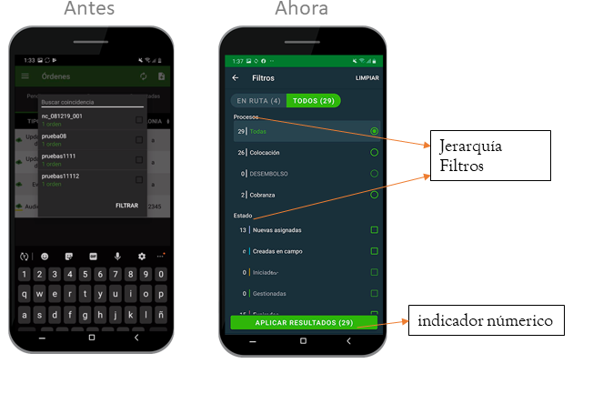
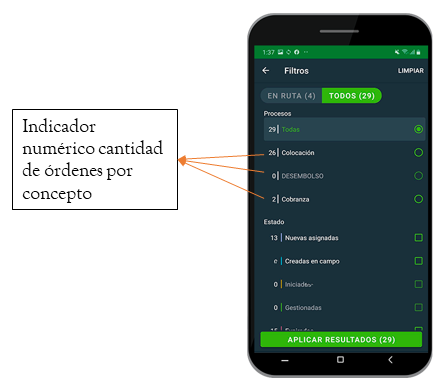

# Filtros

- Los filtros Permite al usuario poder filtrar las órdenes con respecto a su estado general o su relación con otras órdenes y su estado interno de resolución.

- Podrá filtrar por cada uno de los valores que presente en sus auxiliares, respetando la funcionalidad anterior.

- Al jerarquizar la navegación y conceptos, en primer lugar aparece Procesos, ya que un usuario puede tener distintos y esto le permite moverse entre ellos para acomodar su ruta a elección.
Cuando el concepto a filtrar contiene una lista amplia de opciones seleccionables, se muestran las primeras 5 opciones de cada lista, si el usuario desea ver la lista completa puede hacerlo en “ver más” dentro de cada concepto.

    `Se determinaron esta cantidad de elementos, para mejor visualización de la información y no saturar al usuario con todas las opciones elegibles.`

- Cuenta con un indicador númerico de la cantidad de órdenes por concepto, esto es sólo de apoyo para una visión general en la toma de decisiones.

  `Existe un código de color que sirve de soporte una vez que el usuario ha filtrado la información, esto diferenciará el estado en la lista principal.`

- Cuando el concepto a filtrar contiene una lista amplia de opciones seleccionables, se muestran las primeras 5 opciones de cada lista, si el usuario desea ver la lista completa puede hacerlo en “ver más” dentro de cada concepto.​

- Se determinaron esta cantidad de elementos, para mejor visualización de la información y no saturar al usuario con todas las opciones elegibles.​
- Cuenta con un indicador númerico de la cantidad de órdenes por concepto, esto es sólo de apoyo para una visión general en la toma de decisiones.​

- Existe un código de color que sirve de soporte una vez que el usuario ha filtrado la información, esto diferenciará el estado en la lista principal.​
