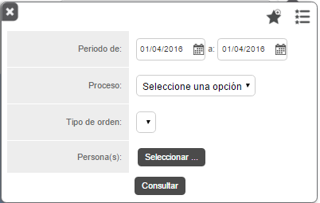
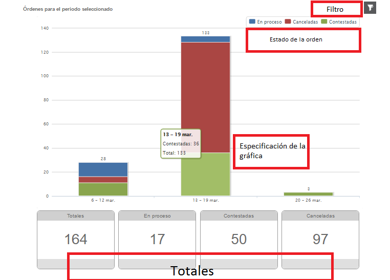

#   Formiik Documentation : Reporte de Órdenes
  
El reporte de órdenes tiene como objetivo mostrar el número de órdenes en sus diferentes estados ( En proceso, Contestadas y Canceladas) en un periodo seleccionado,

El reporte se genera a partir de la selección del periodo (fecha inicio y fin) , el proceso de la cual pertenecen las ordenes, el tipo de orden y la (as) persona (as) de las cuales se requiere el reporte, mostrando como resultado una gráfica especificando el estado en el que se encuentran las ordenes y el total de las mismas.

| Filtro | Descripción |
| --- | --- |
| Periodo de | Comprende el fecha de inicio y fecha de fin de las que se requiere generar el reporte. Requerido |
| Proceso | Se selecciona el proceso mediante el cual se realizará el reporte. No Requerido |
| Tipo de orden | Órdenes correspondientes al proceso señalado en el filtro 'Proceso'. |
| Persona(as) | Se selecciona el (los) usuarios de los que se requiere el reporte. Requerido. Máximo 200 usuarios.  |
| Guardar favorito | Se puede agregar el filtro capturado a favoritos, nombrarlo y seleccionarlo por defecto de forma opcional.  *Si se desea generar otro filtro "por defecto" elimina el anterior y lo sustituye el nuevo filtro asignado.*  |
| Lista de favoritos | Se despliega una lista de los filtros favoritos. |

| Tipo de orden | Descripción |
| --- | --- |
| Ordenes Totales | Todos los status. |
| Ordenes en Proceso | Status: A disposición, Actualizada, En dispositivo, Recibida. |
| Ordenes Contestadas | Status: Respuesta, Respuesta Completa, Enviada al cliente, Falló envío al cliente, Fallo al recibir los archivos. |
| Ordenes Canceladas | Status: Cancelada, Cancelada completa. |

### Gráfica de Resultados 

