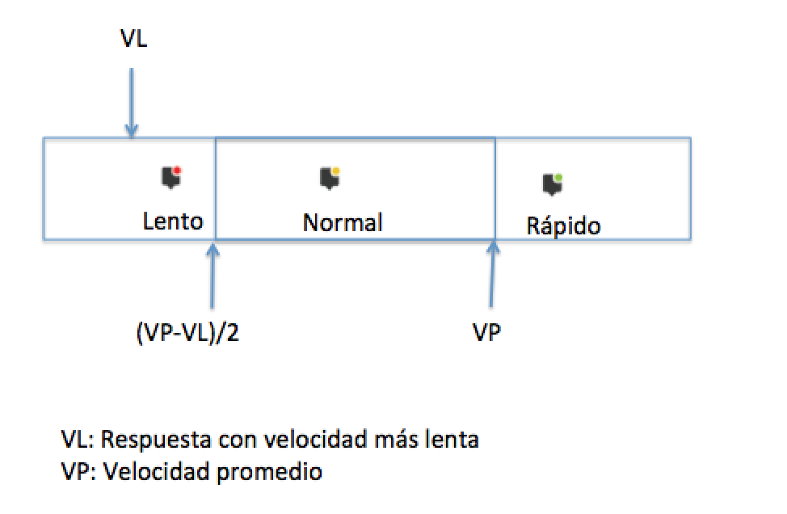
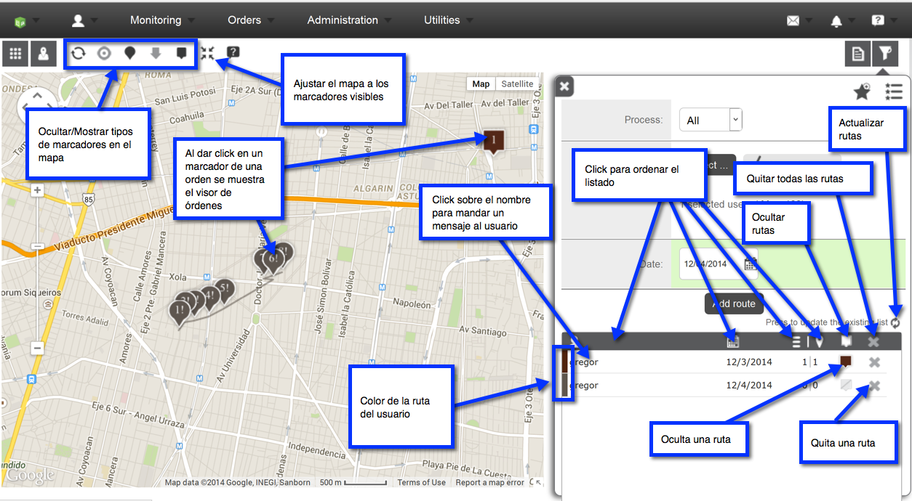
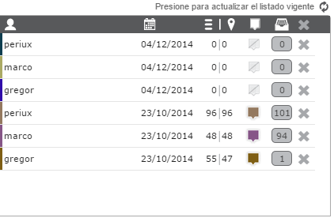

#   Formiik Documentation : Componentes del Reporte de Supervisión
 
 
El reporte de supervisión tiene como objetivo mostrar la operación diaria, para ello se auxilia de un mapa en el cual se representan las ordenes de trabajo y las operaciones de los clientes.

Para esta visualización se consideran varios tipos de iconos que representan una operación u estatus de orden especifica.

A continuación se listan estas operaciones y sus iconos correspondientes.

| Operación | Descripción | Icono |
| --- | --- | --- |
| Orden contestada |  Ocurre cuando las ordenes son contestadas y ya tienen una respuesta ligada (Punto de fin)   Tiempo de viaje rápido   Tiempo de viaje normal  Tiempo de viaje lento  |    |
| Puntos de rastreo | Track por donde el usuario paso al recorrer su ruta (Antes del a versión 3.4 estos puntos indicaban las sincronizaciones, a partir de la 3.4.1 marcan los puntos de Tracking |    |
| Puntos programados |  Este marcador aparece para las órdenes contestadas () y es el indicador del punto donde estaba programada la orden.  |    |
| Orden en ruta |  Indican la ruta planeada de un usuario para el día actual, no se pueden consultar rutas de días anteriores ni posteriores. conforme se van respondiendo órdenes los puntos se transforma de orden en ruta) a  (orden con respuesta)  |    |
| Punto Aquí es | "Aquí es" o "Checkin": Es la respuesta del primer widget de geoposición. (WorkorderResonse.RealLatitude, WorkorderResonse.RealLongitude), El patrón buscado es "Lat:(.\*?)Lon:(.\*?)Sat:(.\*?)Fecha:", en caso de que no se encuentren, se usan las coordenadas finalLatitude y finalLongitude.  |    |
| Orden asignada sin ruta | Son las ordenes que fueron asignadas a un usuario pero aún no forman parte de una ruta ni han sido contestadas |    |
| Inicio de respuesta | Lugar donde se inició a responder la orden |    |
| Fin de respuesta | Lugar en donde se terminó de responder la orden |    |

### Marcadores de velocidad en órdenes respondidas.

En el reporte de supervision de pueden ver en ocasiones una bandera (verde, amarillo y rojo) en el marcador, esta bandera es un indicador de velocidad de respuesta de una orden, la velocidad se calcula en base a la hora de fin de respuesta y a la distancia entre los puntos de fin (distancia lineal) de las órdenes y sólo para aquellas que tienen coordenadas válidas o lo que es lo mismo, las órdenes que se muestran

Cuadricula de Rutas

En esta se representa las ruta obtenidas por el reporte

| Columna | Descripción |
| --- | --- |
| Usuario | Usuario seleccionado para calcular su ruta |
| Calendario | Muestra la fecha con la que fue obtenida la ruta |
| Total de ordenes | Indica las ordenes contestadas con coordenadas válidas mas aquellas con coordenadas invalidas |
| Ordenes conGPS | Muestra el total de ordenes que tienen coordenadas válidas |
| Ver / Ocultar Ruta | Permite Mostrar u ocultar todas las ordenes contestadas por ruta, puede ser general al pulsar sobre el icono de la cabecera del campo o puede ser por ruta al pulsar sobre cada renglón en particular |
| Caja de ordenes | Muestra las ordenes asignadas que aún no tienen respuesta y sin asignación de ruta (requerimiento nuevo), al inicio calcula el total de ordenes y las muestra en la celda correspondiente, si se quiere ver el detalle en el mapa se debe pulsar sobre el botón correspondiente del renglón requerido. Este no funciona de manera general ya que la operación podría ser muy lenta |
| Eliminar Ruta | Para quitar el renglón seleccionado o bien al pulsar sobre el tache en la cabecera de la columna se eliminan todas las rutas |
| Actualizar | Actualiza el listado vigente al agregar nuevos filtros a la ruta.  |
 