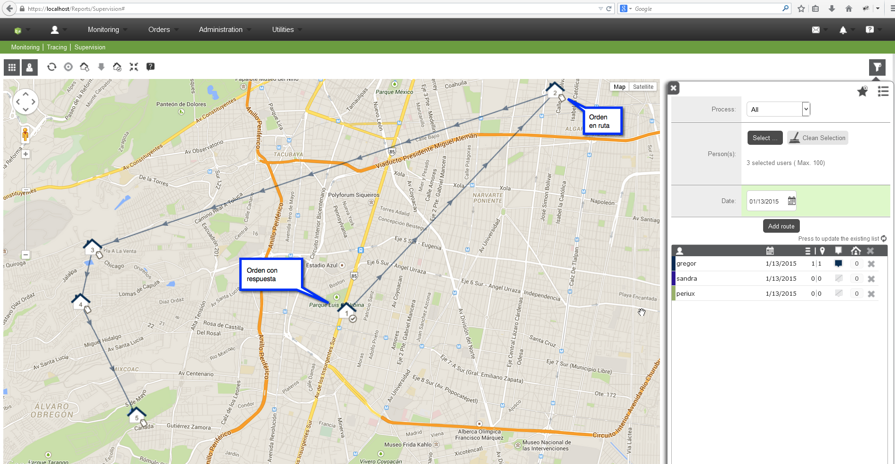

#   Formiik Documentation : Ruta del usuario
  
La ruta está conformada por 2 partes:

1. **Órdenes programadas (sin respuesta)**  
    Si se quiere ver la ruta planeada las órdenes deben tener coordenadas al momento de asignarlas en Formiik, es decir, el cliente debe mandarnos las coordenadas, si las coordenadas las calcula Android la ruta se verá hasta que la nube tenga la respuesta de la orden.
    Si el cliente no manda las coordenadas, éstas se pueden calcular en la nube con el servicio de "Use GeoCoding" y "Auto Geocoding on Map",
    ***NOTA**: Los dos servicios seguramente tienen un costo extra, para habilitarlos habría que consultarlo.*
2. **Órdenes con respuesta (la respuesta ya está en la nube)**  
Las órdenes se muestran siempre y cuando se tengan coordenadas válidas.

La ruta del día se pinta **únicamente para el día actual**, en ella se puede ver el listado de órdenes respondidas y las pendientes que están en ruta.

Si una orden no estaba en la ruta pero se respondió en el día automáticamente se muestra como parte de la ruta.

Android envía la ruta al servidor a partir de la versión: 4.2.0, además el envío de la ruta de android a la nube depende de la Configuración Dispositivo, "routeSync"

Android baja la ruta de la nube a partir de la versión 4.4.2, para que la ruta baje al dispositivo debe tener configurado el setting formiikSyncByNotification en la Configuración del Dispositivo

Las diferentes formas de configurar la ruta del día son:

1. Configuración manual desde Android
2. Optimización de ruta desde Android
3. Optimización de ruta desde la parte de responder órdenes en web (v3.5.1)
4. Configuración de ruta desde asignación manual en Web.

