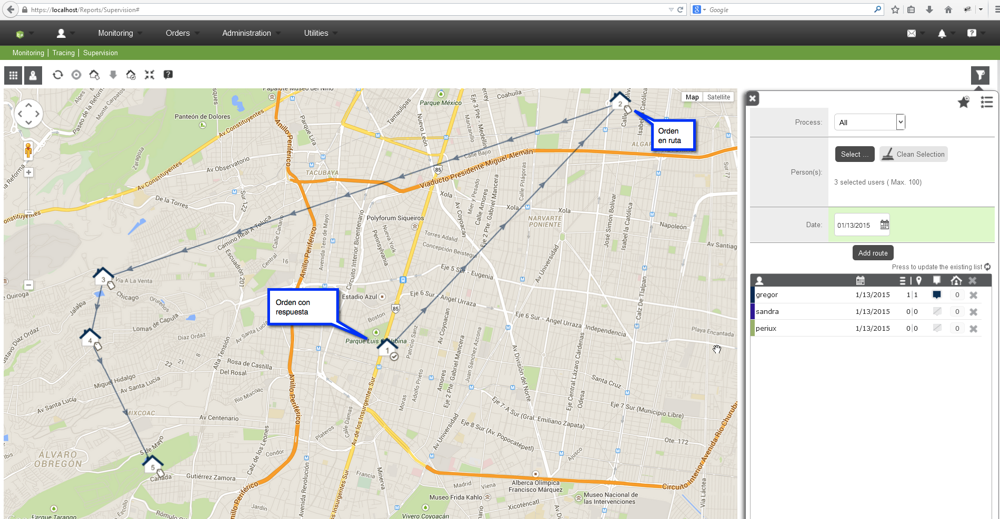
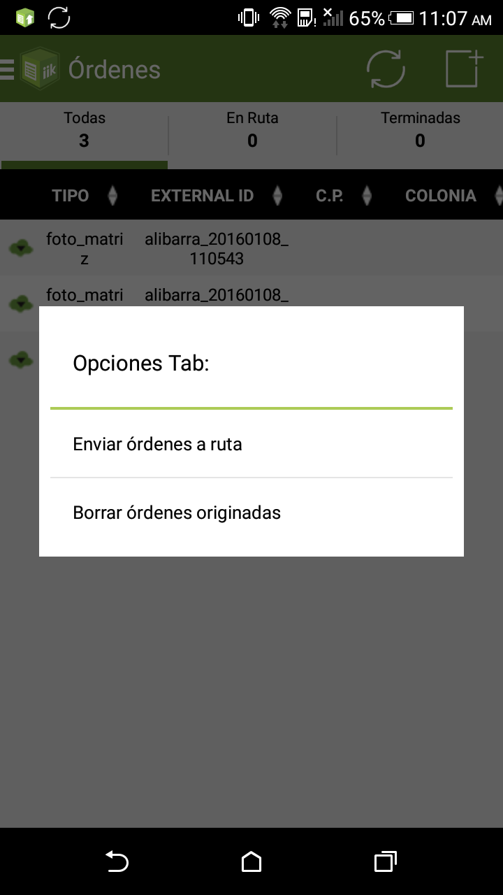
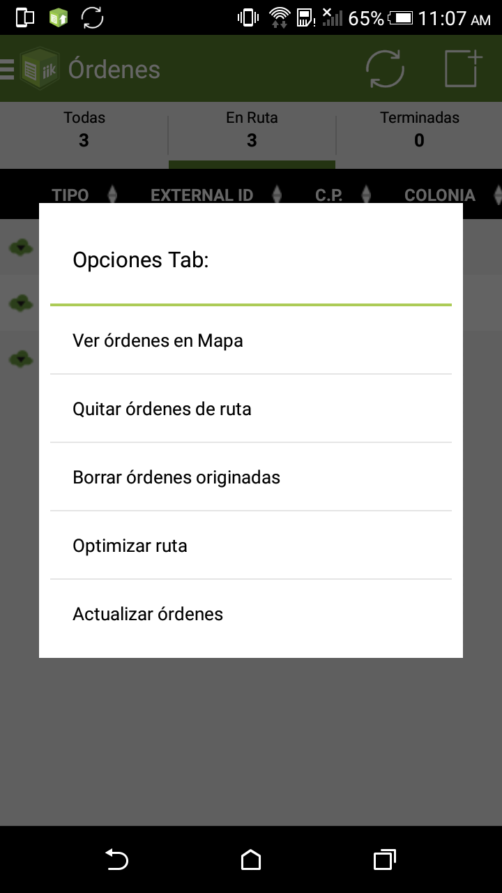
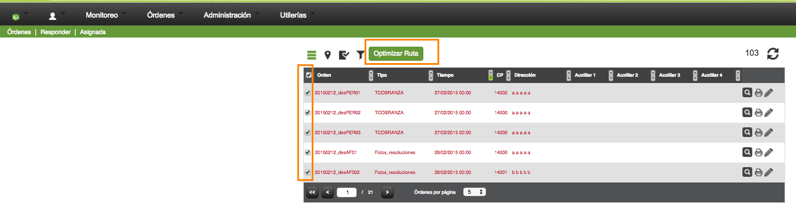

#   Formiik Documentation : Ruta (monitoreo)
 

## La ruta está conformada por 2 partes: 

|  <ol><li><strong>Órdenes programadas (sin respuesta)</strong> 
Si se quiere ver la ruta planeada las órdenes deben tener coordenadas al momento de asignarlas en Formiik, es decir, el cliente debe mandarnos las coordenadas, si las coordenadas las calcula Android la ruta se verá hasta que la nube tenga la respuesta de la orden. 

Si el cliente no manda las coordenadas, éstas se pueden calcular en la nube con el servicio de &quot;<a href="#" rel="nofollow">Use GeoCoding</a>&quot; y &quot;<a href="#" rel="nofollow">Auto Geocoding on Map</a>&quot;, 

<em><strong>NOTA</strong>: Los dos servicios  seguramente tienen un costo extra, para habilitarlos habría que preguntar a Hector.</em>
</li><li><strong>Órdenes con respuesta (la respuesta ya está en la nube)</strong> Las órdenes se muestran siempre y cuando se tengan coordenadas válidas.  </li></ol> La ruta del día se pinta **únicamente para el día actual**, en ella se puede ver el listado de órdenes respondidas y las pendientes que están en ruta.  Si una orden no estaba en la ruta pero se respondió en el día automáticamente se muestra como parte de la ruta.  Android envía la ruta al servidor a partir de la versión: 4.2.0, además el envío de la ruta de android a la nube depende de la Configuración Dispositivo, "routeSync"  Android baja la ruta de la nube a partir de la versión 4.4.2, para que la ruta baje al dispositivo debe tener configurado el setting formiikSyncByNotification en la Configuración del Dispositivo  |  |
| --- | --- |

## Formas de configurar la ruta del día:

|   | **Configuración manual desde android** | **Optimización de ruta desde android** | **optimización de ruta en web**  | **Configuración de ruta desde asignación manual en Web.**  |
| **version** |   |   | (En la parte de responder órdenes) a partir de la version 3.5.1 |   |
| **pasos** | <ul><li>En el tab de &quot;Todas&quot;</li><li>seleccionar la opción enviar a ruta o</li><li>seleccionar las que estarán en ruta marcando el cuadro de selección</li></ul> | <ul><li>
En el tab &quot;Ruta&quot;
</li><li>
seleccionar la opción optimizar ruta
</li></ul> | <ul><li>
Ingresar en la sección de órdenes\responder\asignadas
</li><li>
Después de que ya se hayan puesto ordenes en ruta
</li><li>Revisar que el navegador permita enviar la ubicación</li><li>Al cambiarnos al listado de ruta se mostrará el boton &quot;Optimizar ruta&quot;</li><li>Después de presionarlo acomoda las órdenes y trazara la ruta considerando la ubicación actual del operador</li></ul> | <ul><li>
Ingresar en la sección de órdenes\responder\asignadas
</li><li>
seleccionar las órdenes a agregar a ruta con el cuadro de selección
</li><li>
y al cambiar a la sección de ruta solo estarán aquellas órdenes en ruta
</li></ul> |
|   |  |  |   |  |
 