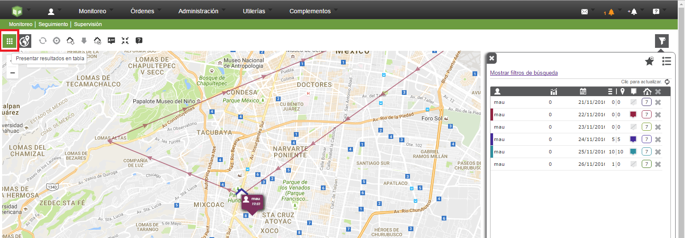
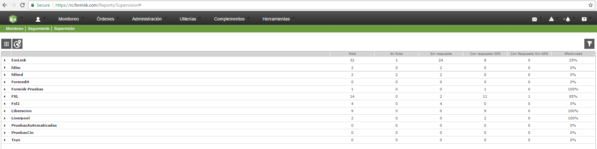
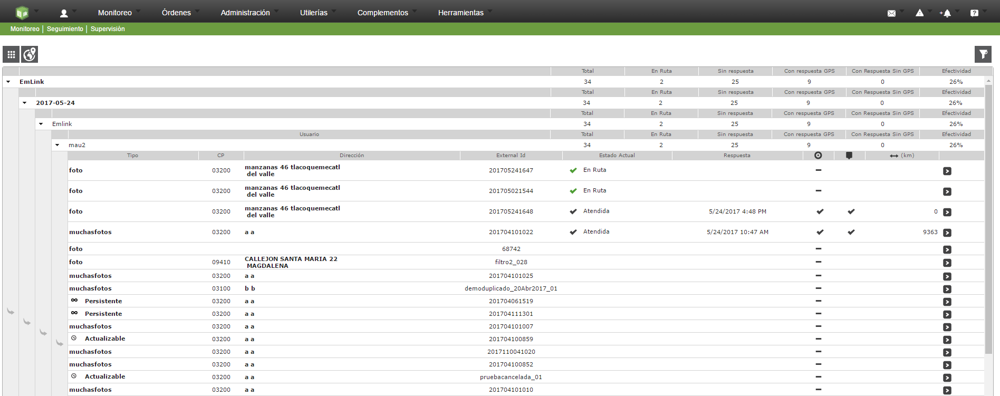

#   Formiik Documentation : Vista Tabla
  
El reporte de supervisión cuenta con una vista tabla en la cual se pueden ver las órdenes asignadas y con respuesta del usuario para cada uno de los procesos con los que cuenta.

Para ingresar a la vista tabla primero se tiene que realizar una consulta de usuario(s) y posteriormente aparecerá un icono como se muestra en la siguiente imagen:

Posteriormente los resultados se mostrarán como se muestra en la siguiente imagen:

Una vez que se presentan los resultados en tabla se cuenta con los siguientes elementos:

| Elemento | Descripción |
| --- | --- |
| Procesos | Procesos asignados al usuario. |
| Total | Total de órdenes del usuario con y sin respuesta, sin contar con los estados de Cancelada, Cancelada Completa. |
| Ruta (apartir versión 4.7.0) | Número de órdenes que tiene el usuario en ruta. |
| Sin respuesta | Número de órdenes sin respuesta. |
| Con respuesta GPS. | Número de órdenes con respuesta y se obtuvo una posición. |
| Con respuesta sin GPS | Número de órdenes con respuesta y que no obtuvo una posición. |
| Efectividad | (Órdenes con respuesta / Total de ordenes asignadas)\*100 |

Posteriormente se pueden desplegar los detalles de cada de uno de los procesos con el siguiente nivel

- Proceso
- Día
- Grupo
- Usuario
- Órdenes

Una vez desplegada la última rama las órdenes cuentan con la siguiente información:

| Dato de la orden. | Descripción |
| --- | --- |
| Tipo | Tipo/formato de la orden. |
| C.P. | Código Postal de asignación. |
| Dirección | Dirección o Punto Programado de la orden asignada. |
| ExternalID | Identificador de la orden. |
| Estado Actual (apartir versión 4.7.0) | Muestra el estado de la orden ya sea que la orden este En Ruta, Atendida, Por Atender. **\*NOTA:****SOLO ESTA COLUMNA ES ORDENABLE , y se ordena ruta, atendida y por atender o viceversa por atender, atentida y en ruta.** |
| Respuesta | Fecha y hora si la orden tiene respuesta. En caso de que esté en dispositivo o a disposición no se muestra información. |
| Ubicación orden | Punto programado: Se muestra un guión medio cuando no cuenta con coordenadas, se muestra con una paloma cuando cuenta con coordenadas o no tiene respuetsta. |
| Fin orden | Orden con respuesta: Se muestra un guión medio si cuenta con respuesta pero coordenadas 0,0, se muestra con una paloma cuando tiene respuesta la orden y coordenadas diferentes a 0,0  |
| Distancia ↔ (km) | Distancia entre el punto programado y el punto donde se respondió la orden. Distancia dada en km. |

La tabla se muestra como en la siguiente imagen:

 