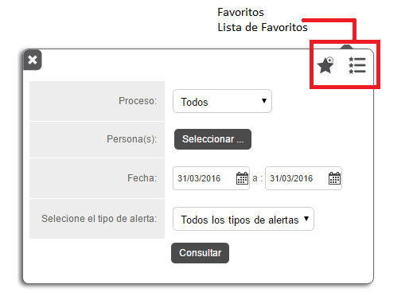
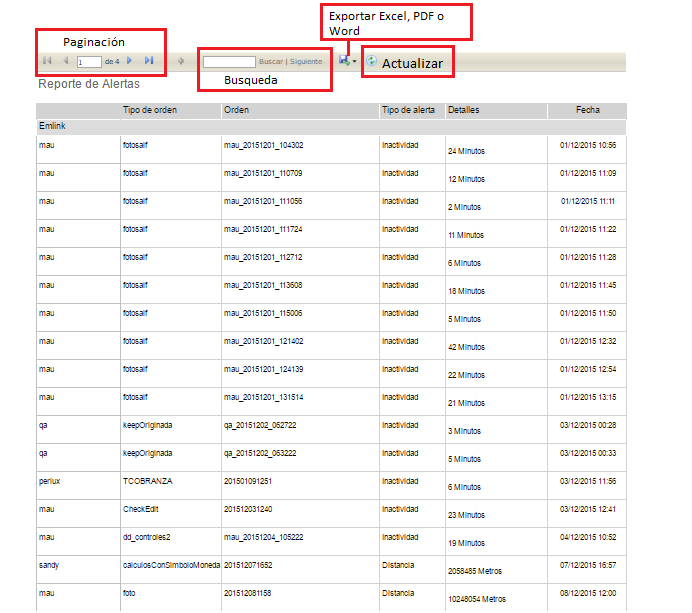

#   Formiik Documentation : Reporte de Alertas
  
El reporte de Alertas tiene como objetivo especificar el tipo de alerta (*Inactividad, Distancia o Geocerca.* 

El reporte se genera a partir de los siguientes filtros:

| Filtro | Descripción |
| --- | --- |
| Proceso | Se selecciona el proceso mediante el cual se realizará el reporte. Por uno o por Todos. |
| Persona(as) | Se selecciona el (los) usuarios de los que se requiere el reporte. Requerido Máximo 200 usuarios |
| Fecha | Comprende el fecha de inicio y fecha de fin de las que se requiere generar el reporte.  |
| Tipo de alerta | Seleccionar el tipo de alerta que se reporte del usuario . Por uno o por Todos |
| Lista de favoritos | Se despliega una lista de los filtros favoritos. |
| Agregar a Favoritos | Se puede agregar el filtro capturado a favoritos, nombrarlo y seleccionarlo por defecto de forma opcional.  *Si se desea generar otro filtro "por defecto" elimina el anterior y lo sustituye el nuevo filtro asignado.*  |

Una vez generado el reporte, es posible realizar las siguientes acciones

|  Acción  |  Descripción  |
| --- | --- |
| Paginación | En caso de contar con un reporte muy extenso este se pagina y es posible navegar de página por página y página inicial y página final. |
| Búsqueda | Es posible realizar búsquedas por usuario, grupo, primer inicio de sesión, último inicio de sesión, número de inicios. |
| Exportar | Descargar Reporte en formatos PDF, Excel o Word. |
| Actualizar | Actualiza el reporte actual. |

Y se compone de los siguientes elementos:

| Columna | Descripción |
| --- | --- |
| Usuario | Usuario que generó alerta |
| Tipo de Orden | Tipo de orden que se respondió y generó la alerta. |
| Orden | External Id del tipo de orden. |
| Tipo de alerta | Inactividad, Distancia o Geocerca |
| Detalles | Especificación del tipo de alerta  |
| Fecha | Fecha y hora de la generación de la alerta  |

#### Ejemplo de resultado de reporte generado

 
