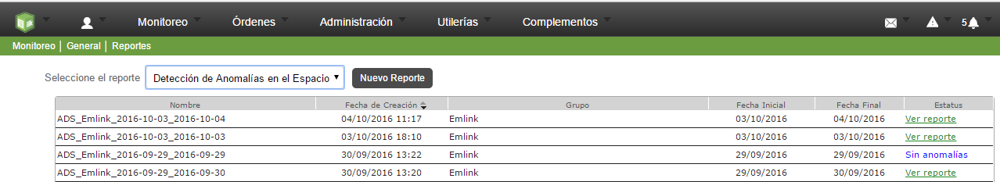

#   Formiik Documentation : Reporte de Anomalías en el Espacio
  
Se determina como anomalía en el espacio cuando dos o mas ordenes se contestan en el mismo lugar durante un día de trabajo.

El objetivo del reportes es mostrar las órdenes que tienen éste comportamiento.

**Nota: Estos reportes a diferencia de los demás son asíncronos por lo cual no se genera inmediatamente, una vez que se genera se muestra una alerta en la barra superior del lado derecho de la pantalla.**

Para generar un reporte da clic en el botón "Nuevo reporte" el cual desplega los filtros siguientes:

| Filtro | Descripción |
| --- | --- |
| Grupo | Grupo del cual se desea buscar anomalías. |
| Periodo | Periodo de tiempo dentro del cual se buscarán anomalías |

Al generar el reporte, en la parte superior derecha de la pantalla aparecerá una notificación indicando que el reporte se genero con éxito y se agrega al grid de reportes como se muestra en la siguiente imagen.

**Nota: Si el reporte no contiene anomalías aparecerá en color azul y con el nombre de "Sin anomalías" y si el reporte contiene anomalías aparecerá de color verde y con la leyenda "Ver reporte".**

****

Al dar click en 'Ver reporte' nos aparece una pantalla en donde se muestra el título del reporte (rango de fechas del reporte), en la parte lateral izquierda aparece una lista de los usuarios que generaron anomalías, la cantidad de días anómalos y el porcentaje con referencia a las órdenes contestadas (tiene la propiedad de colapsarse para dar una mejor vista a la gráfica y a los demás elementos del reporte), en la parte central se muestra la gráfica donde aparecen los datos de los días con anomalías y las órdenes respectivamente, en la parte inferior aparece el listado de las órdenes anómalas y la vista en el mapa de dichas órdenes, en la parte superior derecha aparece el botón para 'Exportar' el reporte a un documento CSV.

### Gráfica de resultado de anomalías

Los datos que se muestran en la gráfica corresponden solo al usuario que se tiene seleccionado, en el eje vertical indica el número de anomalías y el eje horizontal indica el día en que se realizó la anomalía. el punto rojo indica que día se tiene seleccionado para mostrar las anomalías en el listado, ésto se ve reflejado en el título que se encuentra debajo de la gráfica donde se muestra la fecha y el número de anomalías con respecto al total de órdenes contestadas. La gráfica tiene la funcionalidad de colapsarse para poder visualizar mejor los datos del listado y el mapa.

### Resultado en Listado y Resultado en Mapa

El Resultado de las órdenes anómalas aparecen también en una lista en la parte inferior de la gráfica (solo del día que se tiene seleccionado en la gráfica), en este listado se puede ver el external id de la órden, el tipo de formato y la fecha en la que fue contestada.

El resultado de las órdenes anómalas pueden visualizarse en el mapa, las órdenes anómalas se muestran de color rojo y las órdenes no anómalas de color gris, al pasar el cursor por cada una de ellas aparece el external id de la orden, la fecha y hora en la que fue contestada.

Para ambos casos al dar click en una orden aparecerá en la parte lateral derecha el visor de la orden para ver los detalles de la misma, tal como aparece en el gestor.

|    |    |
| --- | --- |

### Exportar reporte

En la parte superior derecha se encuentra el botón para Exportar el reporte a un archivo CSV, al dar click aparece una ventana con la vista previa de los datos que se van a exportar (todos los usuarios que registraron anomalías, el tipo de órden y la fecha) con la opción de cancelar o exportar.

 