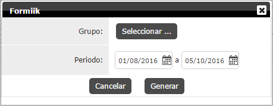
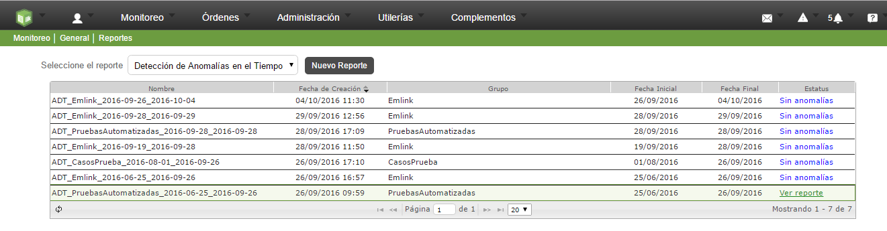
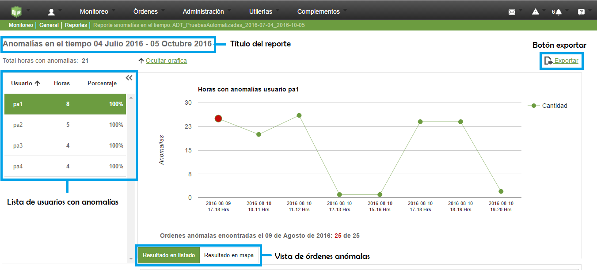
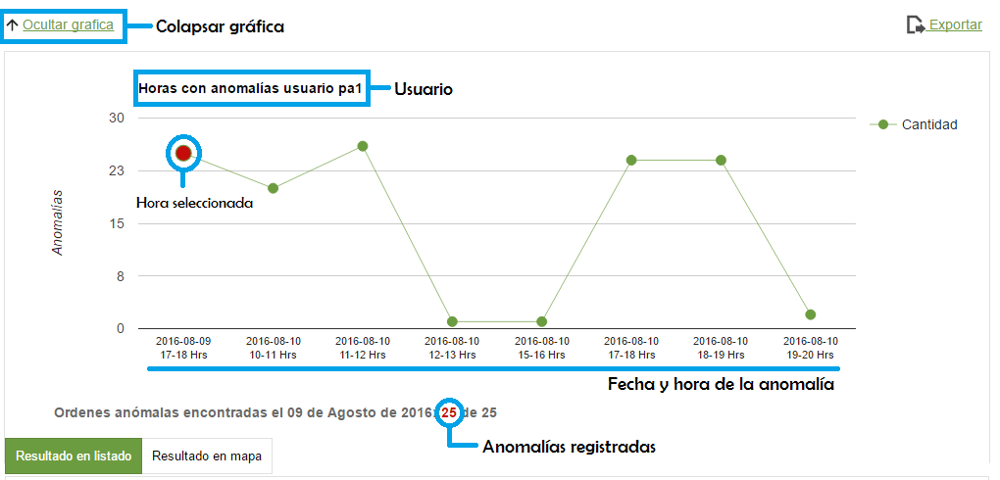
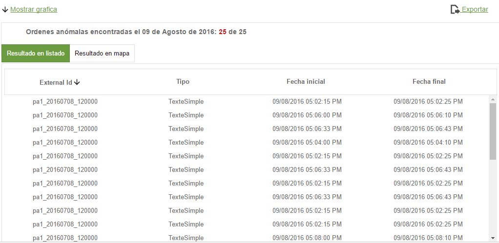
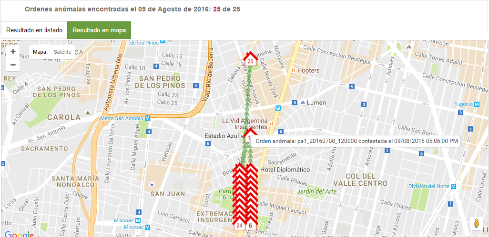
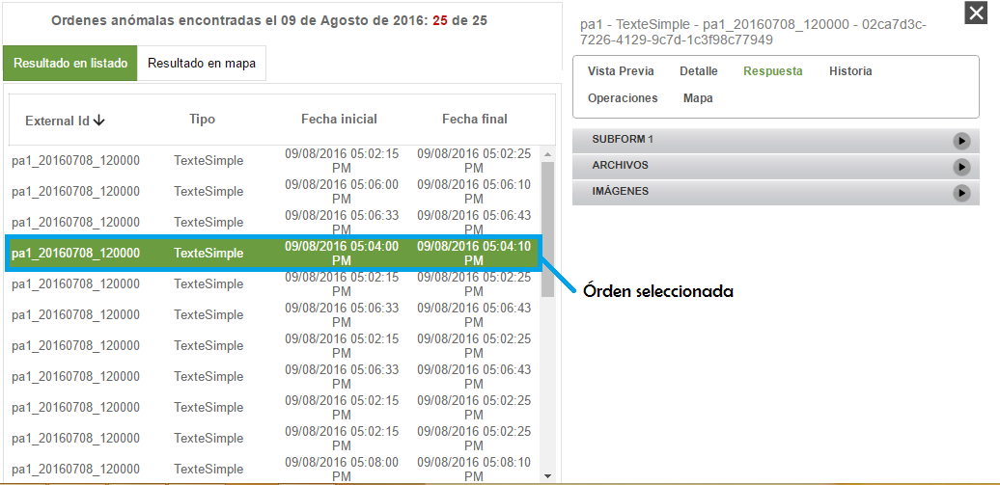
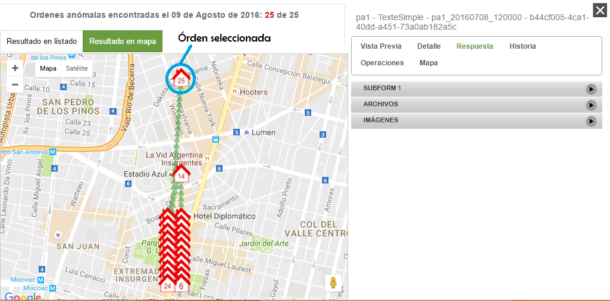
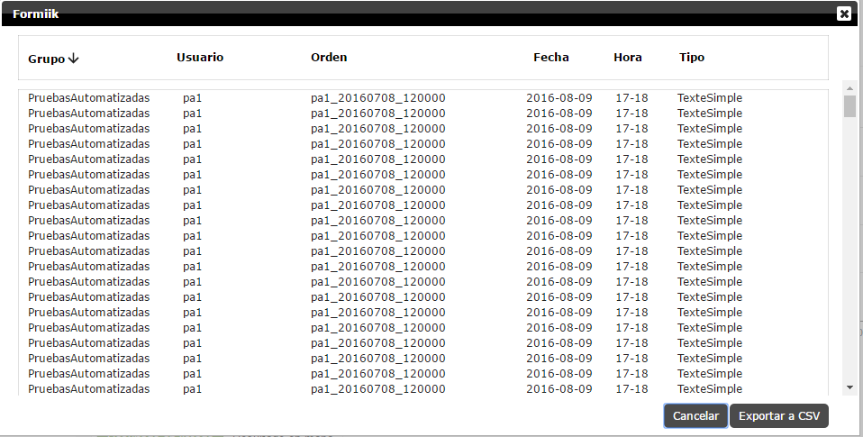

#   Formiik Documentation : Reporte de Anomalías en el Tiempo
 
_Created by Mauricio\_Mondragon , last modified by Cinthia Villeda Cruz on Oct 05, 2016_
 
Se determina como anomalía en el tiempo cuando en un periodo de tiempo se contestan mas órdenes de las que en promedio contesta un usuario.

El objetivo del reporte es mostrar las órdenes que tienen éste comportamiento.

Para generar un reporte es necesario seleccionar el grupo y el periodo que se quiere consultar, como se muestra en la imagen.

**Nota: El reporte solo se genera de un grupo de usuarios, si se seleccionan mucho solo tomara el primer grupo.**

Al generar el reporte, en la parte superior derecha de la pantalla aparecerá una notificación indicando que el reporte se genero con éxito y se agrega al grid de reportes como se muestra en la siguiente imagen.

**Nota: Si el reporte no contiene anomalías aparecerá en color azul y con el nombre de "Sin anomalías" y si el reporte contiene anomalías aparecerá de color verde y con la leyenda "Ver reporte".**

****

Al dar click en 'Ver reporte' nos aparece una pantalla en donde se muestra el título del reporte (rango de fechas del reporte), en la parte lateral izquierda aparece una lista de los usuarios que generaron anomalías, la cantidad de horas anómalas y el porcentaje con referencia a las órdenes contestadas (tiene la propiedad de colapsarse para dar una mejor vista a la gráfica y a los demás elementos del reporte), en la parte central se muestra la gráfica donde aparecen los datos de las horas con anomalías y las órdenes respectivamente, en la parte inferior aparece el listado de las órdenes anómalas y la vista en el mapa de dichas órdenes, en la parte superior derecha aparece el botón para 'Exportar' el reporte a un documento CSV.

****

### Gráfica de resultados

En la gráfica se muestran los resultados del usuario seleccionado, las horas con anomalías que genero el usuario, en el eje vertical aparece la cantidad de anomalías registradas, en el eje horizontal aparece la hora y fecha donde se genero una anomalía, en la parte inferior de la gráfica aparecen las opciones para ver los resultados en dos vistas, en forma de listado o en el mapa, éstos valores dependen de la hora que se tenga seleccionada en la gráfica, también se encuentra una leyenda para saber que día se genero la anomalía y el numero de anomalías con referencia al total de órdenes contestadas. La gráfica tiene la propiedad de colapsarse para poder visualizar mejor los resultados en el listado y mapa.

### Resultado en Listado y Resultado en Mapa

La forma en que se muestran los resultados en forma de listado tiene la información de cada órden anómala que es el external id, tipo de formato y la fecha en la que se contesto la órden, todo esto con relación al punto (hora) que se ha seleccionado en la gráfica.

Los resultados en el mapa se visualizan con dos colores, las órdenes en color rojo son las órdenes anómalas y las de color gris son las órdenes no anómalas, al pasar el cursor por alguna de ellas, aparecerá información sobre la órden (external id, fecha y hora).

Para ambos casos donde se muestra los resultados de las órdenes al dar click en alguna órden aparece en la parte lateral derecha el visor de la órden para poder ver los detalles, tal y como se muestra en el gestor.

|    |    |
| --- | --- |

### Exportar reporte

En la parte superior derecha del reporte se encuentra el botón para exportar el reporte a un archivo de formato CSV, éste contiene el grupo al que pertenece el usuario, el usuario, la órden (external id), la fecha en la que se contesto, la hora y el tipo de formato.

