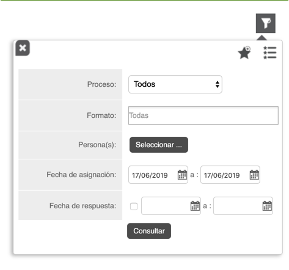
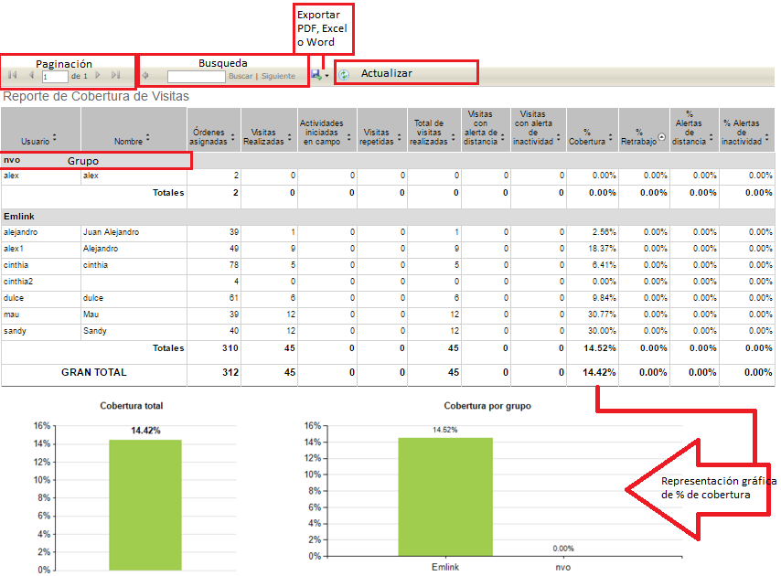

# Reporte de Cobertura de Visitas.
  
El objetivo del reporte de Cobertura de Visitas es consolidar las actividades realizadas por los usuarios de Formiik de forma dinámica y especifica.

El reporte se genera a partir de los siguientes filtros:

| Filtro | Descripción |
| --- | --- |
| Proceso | Se selecciona el proceso mediante el cual se realizará el reporte. Por uno o por Todos |
| Formato | Órdenes correspondientes al proceso señalado en el filtro 'Proceso'. Por uno, por Todos o Varios |
| Personas(as) | Se selecciona el (los) usuarios de los que se requiere el reporte. Requerido. |
| Fecha de asignación | Periodo de Fecha inicial y fecha final de asignación de ordenes. |
| Fecha de respuesta | Periodo de Fecha inicial y fecha final de respuesta de ordenes. Opcional |
| Lista de favoritos | Se despliega una lista de los filtros favoritos.Agregar a Favoritos |
| Agregar a Favoritos | Se puede agregar el filtro capturado a favoritos, nombrarlo y seleccionarlo por defecto de forma opcional.  *Si se desea generar otro filtro "por defecto" elimina el anterior y lo sustituye el nuevo filtro asignado.*  |

Una vez generado el reporte es posible realizar las siguientes acciones:

|  Acción  |  Descripción  |
| --- | --- |
| Paginación | En caso de contar con un reporte muy extenso este se pagina y es posible navegar de página por página y página inicial y página final. |
| Búsqueda | Es posible realizar búsquedas por usuario, grupo, primer inicio de sesión, último inicio de sesión, número de inicios. |
| Exportar | Descargar Reporte en formatos PDF, Excel o Word. |
| Actualizar | Actualiza el reporte actual. |
| Filtrar | Es posible aplicar diversos filtros por columnas |

### El reporte se compone de los siguientes elementos: 

| Columna | Descripción |
| --- | --- |
| Usuario | Usernames seleccionados para generar el reporte. Pueden estar separados dependiendo si se encuentran dentro de un grupo especifico. |
| Nombre | Nombre del usuario. |
| Órdenes asignadas | Total de ordenes asignadas.No se cuentan órdenes que tienen marcado el formato como "Creado en dispositivo" y sólo se cuenta una persistente en caso de haber más de una con el mismo Id externo, también cuenta las órdenes que tienen fecha de asignación correspondiente al periodo elegido. Tampoco se cuentan las órdenes canceladas por cambio de dispositivo o reenvío de órdenes al dispositivo|
| Visitas Realizadas | Total de respuestas a ordenes asignadas por el usuario en el periodo definido. |
| Actividades iniciadas en campo | Total de respuestas a órdenes originadas en campo del usuario en el periodo de respuesta definido. Las órdenes originadas se diferencían por la configuración del formato: "Creados en dispositivo"|
| Visitas repetidas | <ul class="alternate"><li>Si alguna(s) o todas las Órdenes asignadas son persistentes</li><li>Si una visita persistente tiene más de una respuesta, se considera repetida</li></ul> |
| Total de visitas realizadas | Vistas Realizadas + Visitas Iniciadas en campo + Visitas repetidas |
| Visitas con alerta de distancia | Visitas que generaron alerta por distancia |
| Vistas con alerta de inactividad | Visitas que generaron alerta por inactividad |
| Cobertura % | Total de Visitas Realizadas / Órdenes asignadas  |
| Retrabajo % | Visitas repetidas / Visitas realizadas  |
| Alertas de distancia % | Visitas con alerta-distancia / (Visitas realizadas + Visitas repetidas)  |
| Alertas de inactividad % | Visitas con alerta-inactividad / (Visitas realizadas + Visitas repetidas+Visitas originadas)  |

#### Ejemplo de resultado de reporte generado

 