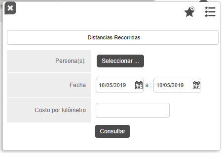
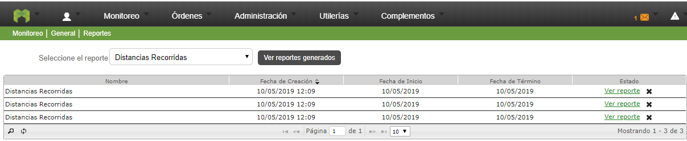
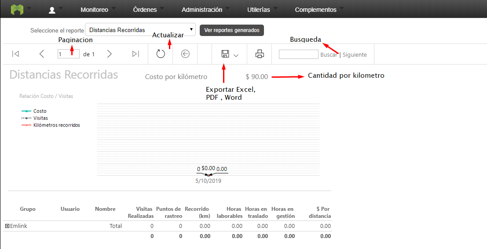
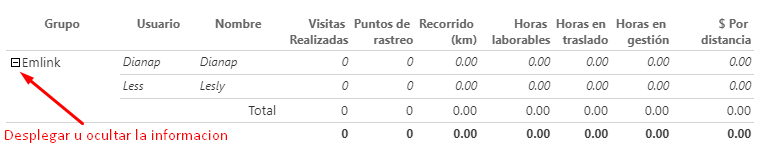

#   Formiik Documentation : Reporte de Distancias Recorridas
 
 
El objetivo de este reporte es saber cuanto dinero se gasta al día y poder realizar comparaciones.

**Nota: Este reporte no genera el estatus inmediatamente después de consultarlo,  una vez que se genera el reporte a diferencia de los demás no genera una alerta.**

**Este reporte requiere de tener un usuario con permisos para poder verlo , los usuarios son : Administrador, Supervisores y Superusuarios.**

Para generar un reporte, dar clic en el botón filtro de consulta  el cual despliega los filtros siguientes:

| Filtro | Descripción  |
| --- | --- |
| Persona(s) | Se selecciona al usuario del que se desea consultar |
| Fecha | Comprende el fecha de inicio y fecha de fin de las que se requiere generar el reporte.  |
| Costo por Kilómetro  | Añadir la cantidad de dinero que se gasto por kilómetro con decimales |

Una vez generado el reporte, es posible realizar las siguientes acciones:

| Acción  | Descripción  |
| --- | --- |
| Paginación | En caso de contar con un reporte muy extenso este se pagina y es posible navegar de página por página y página inicial y página final. |
| Búsqueda | Es posible realizar búsquedas por nombre(s) , fecha de creación, fecha de inicio, fecha de termino. |
| Actualizar  | Recarga los datos actuales |

**Nota: Al haberse consultado el reporte deberá aparecer en color verde con la leyenda "ver reporte".**

**El reporte se compone de los siguientes elementos:**

| Elementos  | Descripción  |
| --- | --- |
| Grupo | Grupo al que el usuario pertenece  |
| Usuario | Username |
| Nombre | Nombre completo del usuario |
| Visitas realizadas | Número de visitas acumuladas para el periodo y filtros seleccionados. |
| Puntos de rastreo  | Número de puntos existentes para el periodo y filtros seleccionados.   |
| Recorrido (km) | Distancia recorrida acumulada para el periodo y filtros seleccionados en km.metros |
| Horas laborables | Es el horario laboral, y  el resultado de la primer y la última respuesta |
| Horas en traslado  | Tiempo total de traslados (quitando los tiempos efectivos de captura idealmente) en horas.minutos. ( primer inicio de gestión y última gestión). |
| Horas en gestión  | La suma de la fecha final - fecha inicial de cada respuesta. |
| Costo por distancia  | Resultado de multiplicar "el costo por KM" por  Distancia recorrida. |

#### Ejemplo de resultado de reporte generado

 
