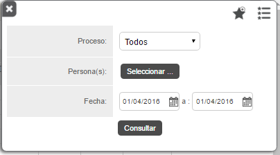
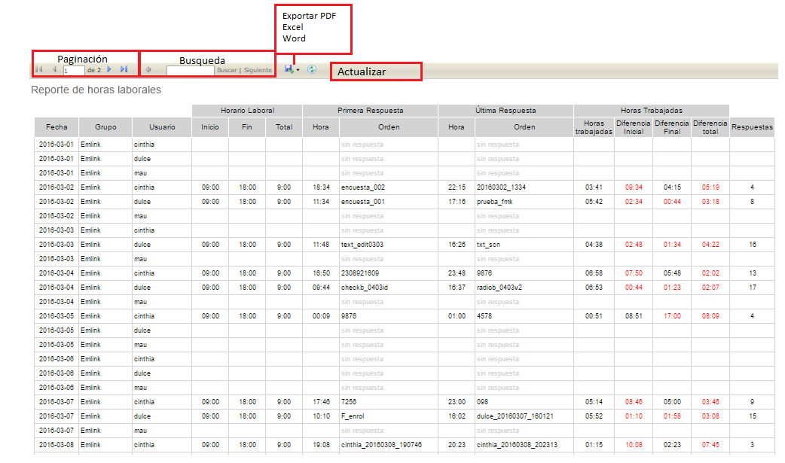

#   Formiik Documentation : Reporte de Horarios Laborales
  
El objetivo del reporte de Horarios Laborales es desglosar el detalle del horario laboral y las ordenes contestadas dentro ese lapso.

El reporte se genera a partir de los siguientes filtros:

| Filtro | Descripción |
| --- | --- |
| Proceso | Se selecciona el proceso mediante el cual se realizará el reporte. Por uno o por Todos. |
| Persona (as) | Se selecciona el (los) usuarios de los que se requiere el reporte. Requerido.  |
| Fecha | Comprende el fecha de inicio y fecha de fin de las que se requiere generar el reporte.  |
| Lista de favoritos | Se despliega una lista de los filtros favoritos.Agregar a Favoritos |
| Agregar a Favoritos  | Se puede agregar el filtro capturado a favoritos, nombrarlo y seleccionarlo por defecto de forma opcional.  *Si se desea generar otro filtro "por defecto" elimina el anterior y lo sustituye el nuevo filtro asignado.*  |

Una vez generado el reporte, es posible realizar las siguientes acciones

|  Acción  |  Descripción  |
| --- | --- |
| Paginación | En caso de contar con un reporte muy extenso este se pagina y es posible navegar de página por página y página inicial y página final. |
| Búsqueda | Es posible realizar búsquedas por usuario, grupo, fecha, orden etc. |
| Exportar | Descargar Reporte en formatos PDF, Excel o Word. |
| Actualizar | Actualiza el reporte actual. |

#### El reporte se compone de los siguientes elementos: 

| Columna | Descripción |
| --- | --- |
| Fecha | Fecha laborada |
| Grupo | Grupo al que pertenece el usuario |
| Usuario | Username del usuario |
| Horario Laboral | <ul><li>Inicio: Hora en formato 24 hrs. de inicio de jornada laboral.</li><li>Fin: Hora en formato 24 hrs. de fin de jornada laboral.</li><li>Total: total de horas laboradas al día.</li></ul> |
| Primera Respuesta | <ul><li>Hora: Hora exacta en formato 24 hrs. en la que se contestó la primer orden en el día.</li><li>Orden: External Id de la primer orden contestada en el día.</li><li>La hora se toma del campo Respuesta Fin de la historia de la orden. Y esta hora es del dispositivo(Almacenada en FinalDate tabla workorderresponse). </li></ul> |
| Última respuesta | <ul><li>Hora: Hora exacta en formato 24 hrs. en la que se contestó la última orden en el día.</li><li>Orden: External Id de la última orden contestada en el día.</li><li>La hora se toma del campo Respuesta Fin de la historia de la orden. Y esta hora es del dispositivo(Almacenada en FinalDate tabla workorderresponse).</li></ul> |
| Horas trabajadas | <ul><li>Horas trabajadas: Hora de última respuesta - hora de primera respuesta</li><li>Diferencia inicial: Hora de primera respuesta - Inicio de horario laboral</li><li>Diferencia final: Hora de última repuesta - Fin de horario laboral</li><li>Diferencia total: Total de horas en Horario laboral - Horas trabajadas</li></ul> |
| Respuestas | Total de ordenes respuestas en la fecha indicada. |

#### Ejemplo de resultado de reporte generado

 
