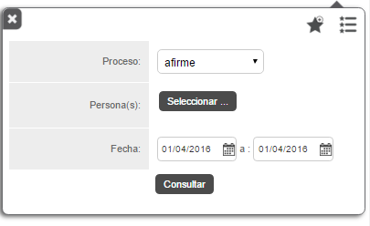
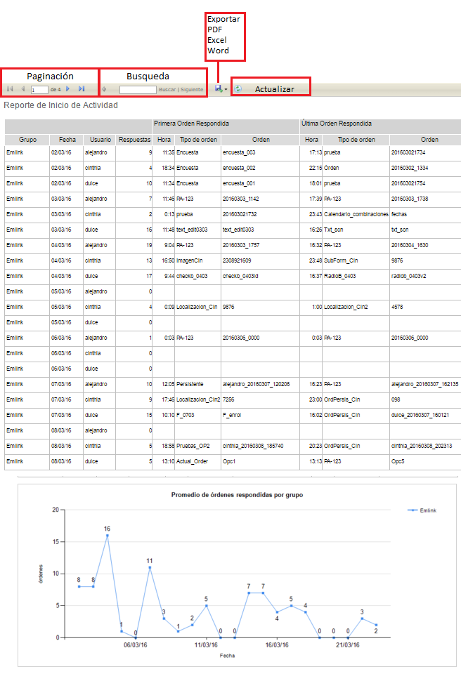

#   Formiik Documentation : Reporte de Inicio de Actividad
  
El objetivo del reporte de Inicio de Actividad es generar un resumen de la actividad diaria de los usuarios mostrando desde el numero de respuestas generadas, la hora y tipo de orden que se respondieron.

El reporte se genera usando los siguientes filtros:

|  Filtro  |  Descripción  |
| --- | --- |
| Proceso | Se selecciona el proceso mediante el cual se realizará el reporte. Por uno o por Todos. |
| Persona (as) | Se selecciona el (los) usuarios de los que se requiere el reporte. Requerid. 200 usuarios máximo.  |
| Fecha | Comprende el fecha de inicio y fecha de fin de las que se requiere generar el reporte.  |
| Lista de Favoritos | Se despliega una lista de los filtros favoritos.Agregar a Favoritos |
| Guardar favorito | Se puede agregar el filtro capturado a favoritos, nombrarlo y seleccionarlo por defecto de forma opcional.  *Si se desea generar otro filtro "por defecto" elimina el anterior y lo sustituye el nuevo filtro asignado.*  |

Una vez generado el reporte, es posible realizar las siguientes acciones

|  Acción  |  Descripción  |
| --- | --- |
| Paginación | En caso de contar con un reporte muy extenso este se pagina y es posible navegar de página por página y página inicial y página final. |
| Búsqueda | Es posible realizar búsquedas por usuario, grupo, fecha, orden etc. |
| Exportar | Descargar Reporte en formatos PDF, Excel o Word. |
| Actualizar | Actualiza el reporte actual. |

### El reporte de Inicio de actividad consta de los siguientes elementos: 

| Columna | Descripción |
| --- | --- |
| Grupo | Grupo al que pertenece el usuario y ordenes |
| Fecha | Fecha de la actividad |
| Usuario | Username del usuario |
| Respuestas | Total de ordenes contestadas en la fecha señalada |
| Primera Orden Respondida | <ul><li>Hora: Hora exacta de la primer orden contestada en la fecha correspondiente. Esta hora la toma del FinalDate de la respuesta</li><li>Tipo de Orden: Tipo de orden que fue contestada</li><li>Orden: External Id de la orden contestada.</li></ul> |
| Ultima Orden Respondida | <ul><li>Hora: Hora exacta de la última orden contestada en la fecha correspondiente. Esta hora la toma del FinalDate de la respuesta.</li><li>Tipo de Orden: Tipo de orden que fue contestada</li><li>Orden: External Id de la orden contestada.</li></ul> |
| Promedio de órdenes respondidas por grupo  | Se genera una gráfica donde se muestra el promedio del reporte generado por fecha en las que se realizó actividad y el número de ordenes contestadas. |

#### Ejemplo de resultado de reporte generado

