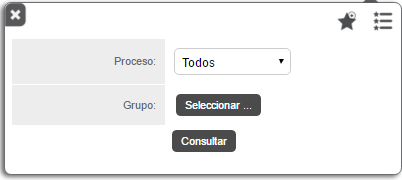
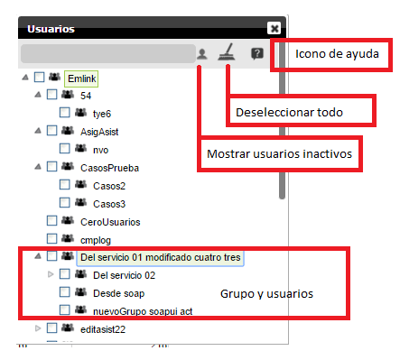
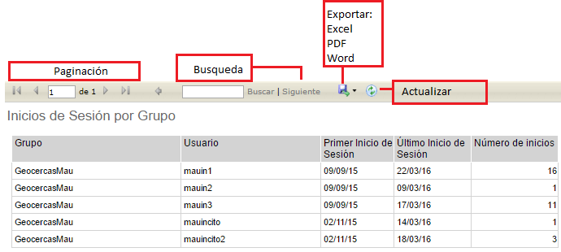

#   Formiik Documentation : Reporte de Inicios de Sesión por Grupo
  
El reporte de Inicios de Sesión por Grupo tiene como objetivo desglosar y especificar el primer y último inicio de sesión de cada usuario perteneciente a un grupo dentro de un proceso.

El reporte se genera a partir de los siguientes filtros.

| Filtro | Descripción |
| --- | --- |
| Proceso | Se selecciona el proceso mediante el cual se realizará el reporte. Por uno o por Todos. |
| Grupo | Grupos activos o inactivos visibles. Por uno o por Todos. |
| Lista de Favoritos | Se despliega una lista de los filtros favoritos. |
| Guardar favorito | Se puede agregar el filtro capturado a favoritos, nombrarlo y seleccionarlo por defecto de forma opcional.  *Si se desea generar otro filtro "por defecto" elimina el anterior y lo sustituye el nuevo filtro asignado.*  |

A continuación se muestran los componentes del filtro 'Grupo'.

Una vez generado el reporte, es posible realizar las siguientes acciones

| Acción | Descripción |
| --- | --- |
| Paginación | En caso de contar con un reporte muy extenso este se pagina y es posible navegar de página por página y página inicial y página final. |
| Búsqueda | Es posible realizar búsquedas por usuario, grupo, primer inicio de sesión, último inicio de sesión, número de inicios. |
| Exportar | Descargar Reporte en formatos PDF, Excel o Word. |
| Actualizar | Actualiza el reporte actual. |

#### El reporte de inicio de sesión por grupo de compone de los siguientes elementos:

| Columna | Descripción |
| --- | --- |
| Grupo | Grupo seleccionado para generar el reporte |
| Usuario | Usuario perteneciente al grupo seleccionado |
| Primer inicio de sesión | Primer registro de inicio de sesión en el proceso dentro de ese grupo. |
| Último inicio de sesión | Último registro de inicio de sesión en el proceso dentro de ese grupo.  |
| Número de inicios | Sumatoria de los inicios de sesión del mes en curso. |

#### Ejemplo de resultado de un reporte generado

