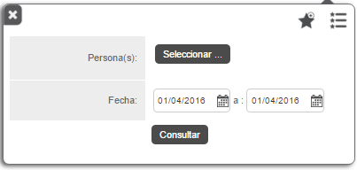
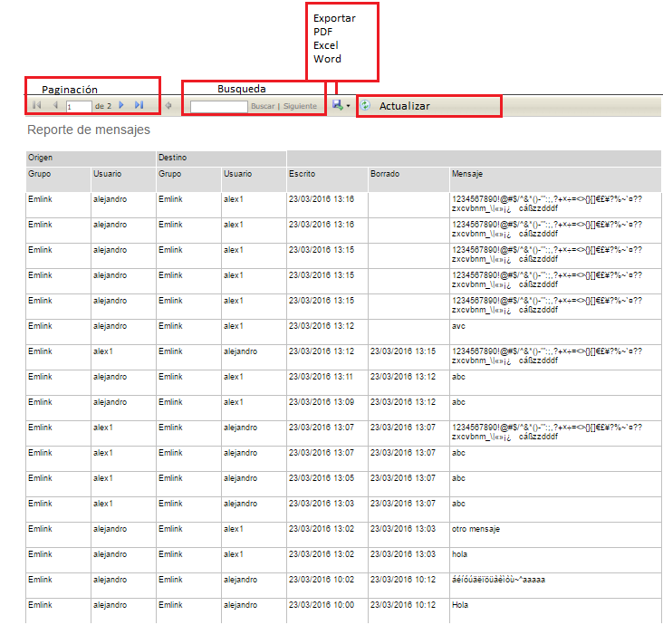

#   Formiik Documentation : Reporte de Mensajes
  
El reporte de Mensajes tiene como objetivo mostrar un historial de conversaciones de uno o varios usuarios.

El reporte se genera a partir de los siguientes filtros:

| Filtro | Descripción |
| --- | --- |
| Persona (as) | Se selecciona el (los) usuarios de los que se requiere el reporte. Requerido. 200 usuarios máximo.  |
| Fecha | Comprende el fecha de inicio y fecha de fin de las que se requiere generar el reporte.  |
| Lista de favoritos | Se despliega una lista de los filtros favoritos.Agregar a Favoritos |
| Guardar favorito | Se puede agregar el filtro capturado a favoritos, nombrarlo y seleccionarlo por defecto de forma opcional.  *Si se desea generar otro filtro "por defecto" elimina el anterior y lo sustituye el nuevo filtro asignado.*  |

Una vez generado el reporte, es posible realizar las siguientes acciones

|  Acción  |  Descripción  |
| --- | --- |
| Paginación | En caso de contar con un reporte muy extenso este se pagina y es posible navegar de página por página y página inicial y página final. |
| Búsqueda | Es posible realizar búsquedas por usuario, grupo, fecha, orden etc. |
| Exportar | Descargar Reporte en formatos PDF, Excel o Word. |
| Actualizar | Actualiza el reporte actual. |

### El reporte de mensajes se compone de los siguientes elementos. 

| Columna | Descripción |
| --- | --- |
| Origen | <ul><li>Grupo: Grupo al que pertenecen los usuarios.</li><li>Usuario: username del emisor del mensaje.</li></ul> |
| Destino | <ul><li>Grupo:Grupo al que pertenecen los usuarios.</li><li>Usuario: username del receptor del mensaje.</li></ul> |
| Escrito | Fecha y hora en que se envió el mensaje |
| Borrado | Fecha y hora en que se eliminó el mensaje de la conversación |
| Mensaje | Texto del mensaje. |

#### Ejemplo de resultado de reporte generado 

 