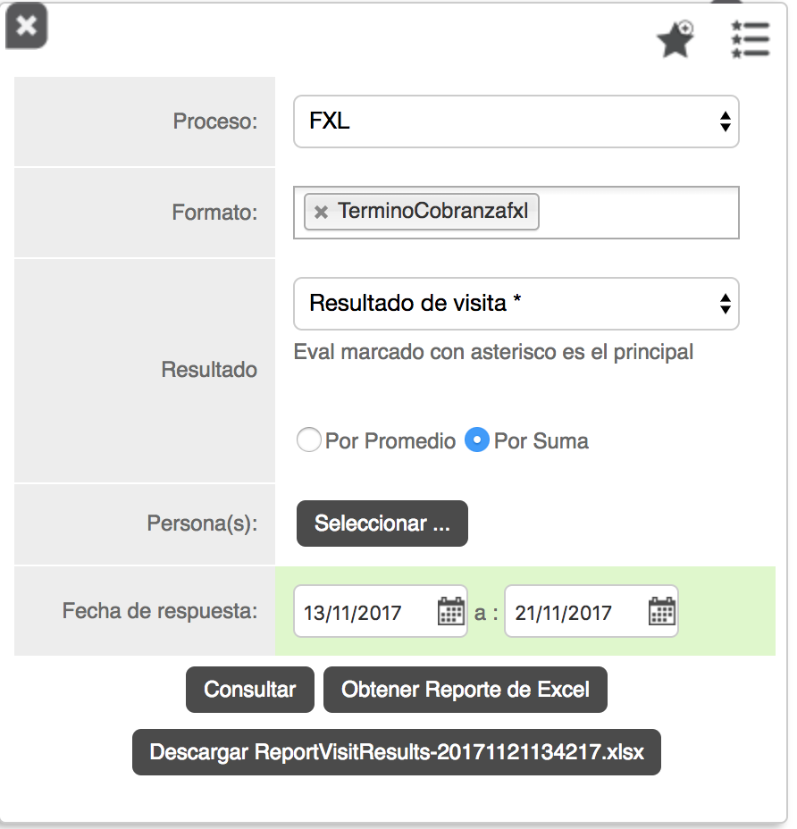
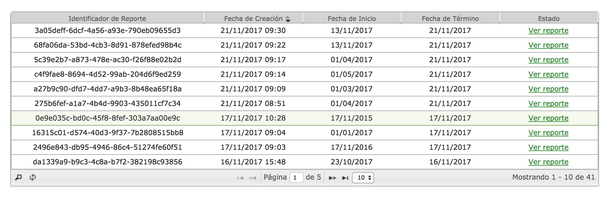
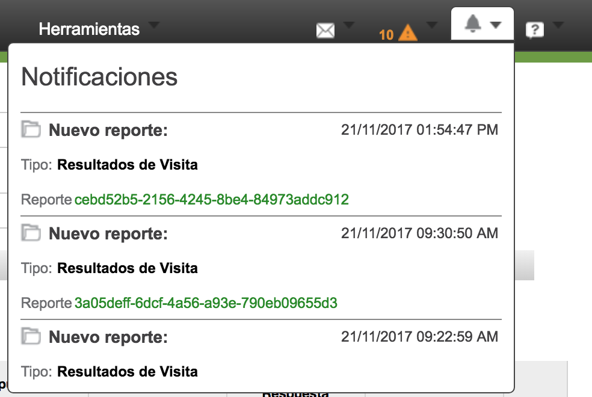
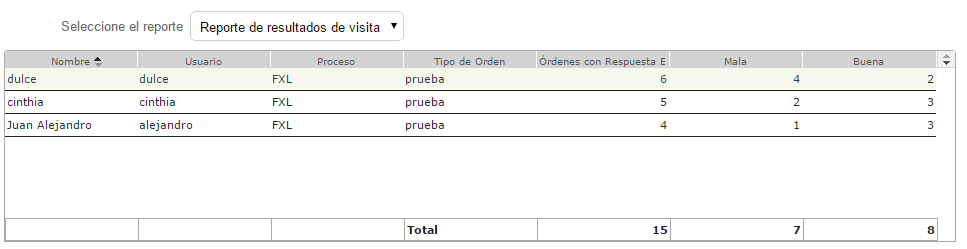
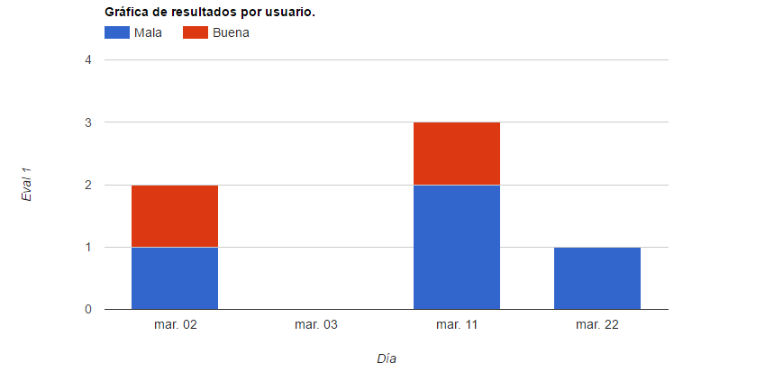
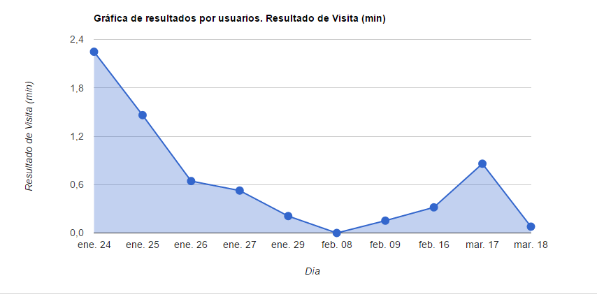
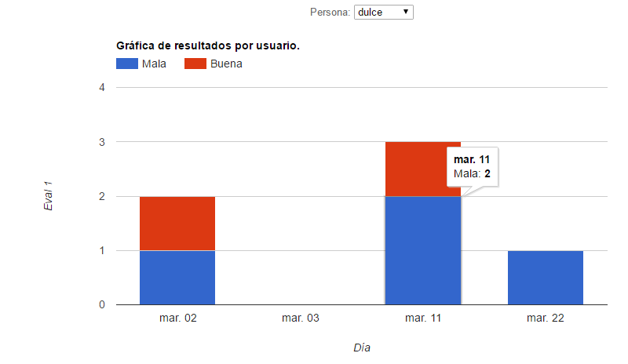
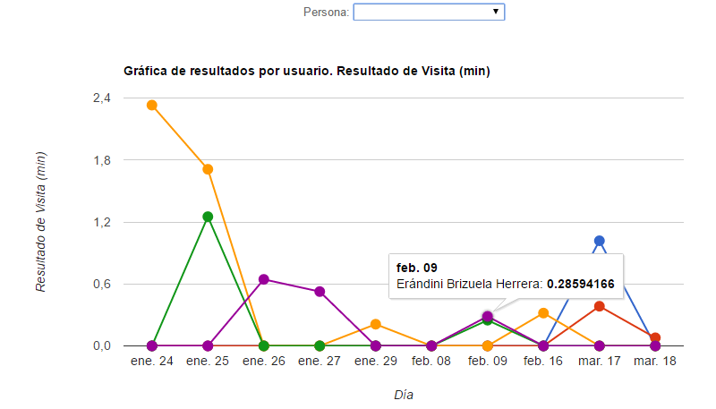

#   Formiik Documentation : Reporte de Resultados de Visita
  
El reporte de Resultado de Visita tiene como objetivo desglosar el resultado de una orden contestada que contenga dentro de su formulario el widget "Eval" texto o numérico.

**Notas:**

- **Para que sea posible generar el reporte en necesario que el cliente tenga activo el setting "Is using documentdb to save eval response", en administración de procesos.**
- **Debe estar configurado el storage center del cliente en Document DB.**
- **Los datos para el reporte se extraen de Document DB.**
- **Los datos guardados en el reporte solo pueden ser cadenas o númericos.**
- **Existe un Eval en el formato que se considera Principal, llamado valor Formiik, que aparece en el reporte con un asterisco. Éste sólo puede ser numérico (de no ser así se ignorará) y sirve para utilizarlo en el ranking del Formiik Game. Los demás Evales del formato pueden ser de cualquier tipo e igualmente aparecerán en el reporte.**
- **El resultado Principal (valor Formiik) deber ser únicamente numérico y se guarda en el campo WorkOrderResult, POR LO CUAL HAY QUE TENER CUIDADO AL DEFINIR LA EXPRESION PARA EL EVAL QUE GUARDARA DICHO RESULTADO.ç**

### **Filtros**

El reporte se genera a partir de los siguientes filtros:

|  Filtro  |  Descripción  |
| --- | --- |
| Proceso | Se selecciona el proceso mediante el cual se realizará el reporte. Solo por uno.  |
| Formato: | Formato correspondiente al proceso del que se generará el reporte. Por uno o por todas.  |
| Resultado | Resultado general o respuesta especifica por Eval.  Opciones de Evales del formato.\* <ul><li>Por Promedio</li><li>Por Suma</li></ul> \*Si se selecciona un proceso y/o un formato en especifico, en la lista de selección aparecerán los nombres de todos los widgets tipo Eval, en caso de que no se seleccione proceso ni formato solo mostrará  el Eval "Resultado de visita" y si un Eval tiene el mismo Identificador en todos los formatos también se mostrará en la lista.  |
| Persona(as) | Se selecciona el (los) usuario(s) de los que se requiere el reporte. Requerido |
| Fecha | Comprende el periodo de fecha de inicio y fecha de fin de las que se requiere generar el reporte.  |
| Lista de favoritos | Se despliega una lista de los filtros favoritos. |
| Guardar favoritos | Se puede agregar el filtro capturado a favoritos, nombrarlo y seleccionarlo por defecto de forma opcional.  *Si se desea generar otro filtro "por defecto" elimina el anterior y lo sustituye el nuevo filtro asignado.*  |
| Obtener Reporte de Excel | Genera el reporte en un archivo tipo .xlsx (El titulo del archivo se compone por el titulo del tipo de reporte , continuo de la fecha y hora en que se generó el reporte.)  sin necesidad de realizar la consulta de forma previa. |

### Cuadrícula de Reportes.

La vista principal del Reporte de Resultados de Visita es la cuadricula de reportes, en la cuál se muestran todos los reportes/consultas generados por el usuario en una tabla como la siguiente:

| Columna | Descripción |
| --- | --- |
| Identificador de Reporte | Id único que se genera a partir de la solicitud de una consulta.  |
| Fecha de Cración  | Fecha y hora la que sea realizó la consulta.   |
| Fecha de Inicio | Fecha inicial del rango que comprende el reporte. |
| Fecha de Término | Fecha final del rango que comprende el reporte.  |
| Estado | Estado en el que se encuentra el reporte; En Proceso o Ver Reporte.  |
| Buscador | Realiza busqueda por Id, Fecha de creación, inicio o término y Estado.  |
| Actualizar | Actualiza la tabla.  |
| Paginación | Secciona la tabla en 5, 10 o 15 resultdos a mostrar.   |

Al realizar la consulta, el reporte se generará de forma asincrona, es decir, por medio de los datos almancenados en DocumentDB se procesarán para la creación de este reporte. Dependiendo de la magnitud del reporte será el tiempo que demoré; para notificar al usuario que el reporte de la consulta generada está listo, se mostraá una notificación en el portal web con una el tipo de reporte, fecha y hora, y una liga de Identificador que lo dirigirá al reporte terminado.

  
Una vez generado el reporte accediendo desde la cuadricula o la notificación, puede visualizarse de la siguiente forma:

| Columna | Descripción |
| --- | --- |
| Nombre | Nombre del usuario que contestó la orden |
| Usuario | Username del usuario que contestó la orden |
| Proceso | Proceso al cuál corresponde la orden contestada. |
| Tipo de Orden | Nombre de la orden contestada. |
| Ordenes con Respuesta Eval | Número de ordenes contestadas por el usuario correspondiente. |
| Respuestas | Las siguientes columnas dependen de la configuración del Eval, y las posibles respuestas asignadas, |
| Total | Totales de las respuestas correspondientes. |

De la tabla anterior se generan un par de gráficas, la primera muestra los resultados generales de acuerdo a los filtros aplicados

####  Gráfica de resultados por usuario con valor de Texto. Gráfica de resultados por usuario con valor de Numérico. 

En la segunda gráfica se puede especificar el usuario del que se desea el detalle de la visita, o se muestra el detalle de cada usuario en la misma gráfica.

####  Gráfica de resultados por usuario con valor de Texto. Gráfica de resultados por usuario con valor de Numérico. 

