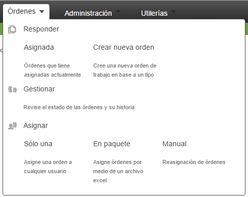

# Asignar

En la pestaña de "Órdenes", en la sección de "Asignar", se pueden seleccionar tres opciones diferentes para asignar órdenes, "Sólo Una", "En Paquete" y "Manual", tal como se ilustra en la **Imagen 1.**

