# Asignacion Asistida Manual

Se accede desde el portal en el menú Órdenes | Manual.

Posteriormente se da clic en el botón de **Asignación asistida** como se muestra en la siguiente imagen (3er Icono de izquierda a derecha)

**Nota**: el ícono sólo aparecerá si la estrategia permite la interacción humana.

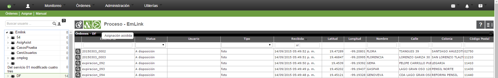

Posteriormente se muestra el mapa con la posible asignación de las órdenes a los usuarios del grupo.

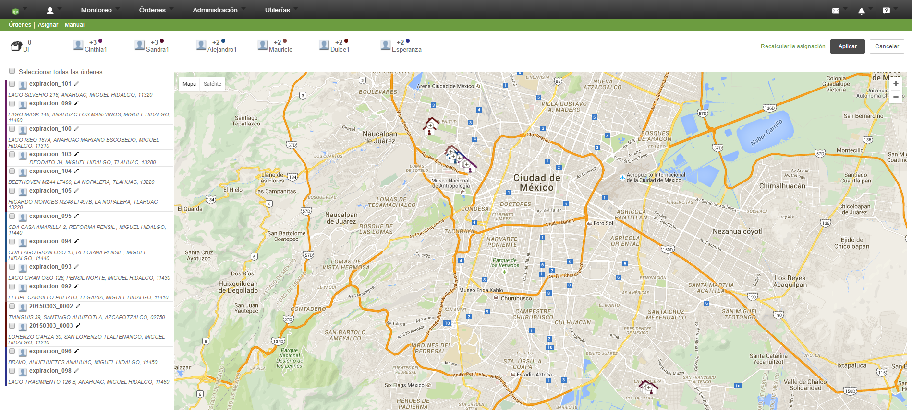

Una vez calculada la asignación posible se pueden realizar las siguientes acciones:

- Recalcular la asignación  
  
Vuelve a calcular la asignación de órdenes en base a la estrategia del grupo  
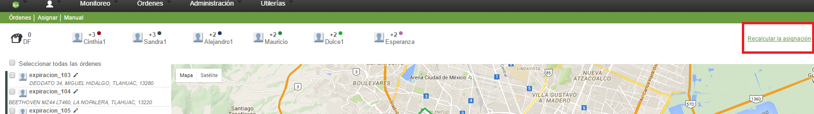

- Aplicar la asignación  
  
Aplica la asignación de órdenes a los usuarios del grupo  
  
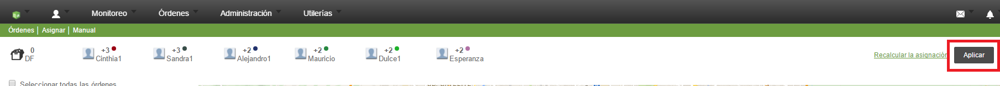

- Cancelar la asignación  
  
Cancela la posible asignación y regresa a la vista de grid de las órdenes.  
  
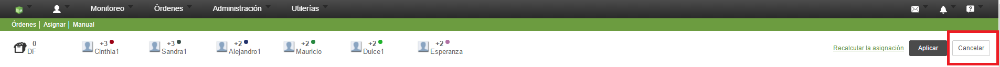

- Asignar todas  
  
Asigna todas las órdenes a un usuario del grupo, para ello se deben seleccionar todas las órdenes con el chekbox que se encuentra del lado superior izquierdo.   
  
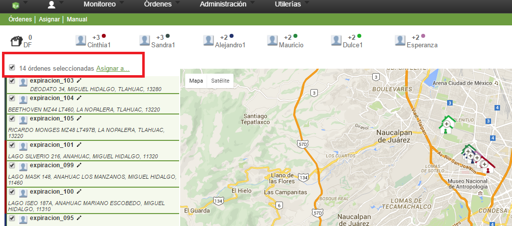
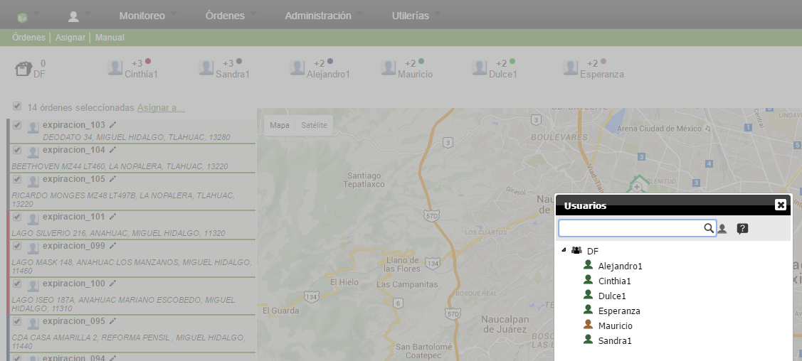

- Ver las órdenes de un usuario  
  
Ver las posibles órdenes que serán asignadas a un usuario, para ello se debe seleccionar algún usuario del grupo, ubicados en la parte superior de la página.  
  
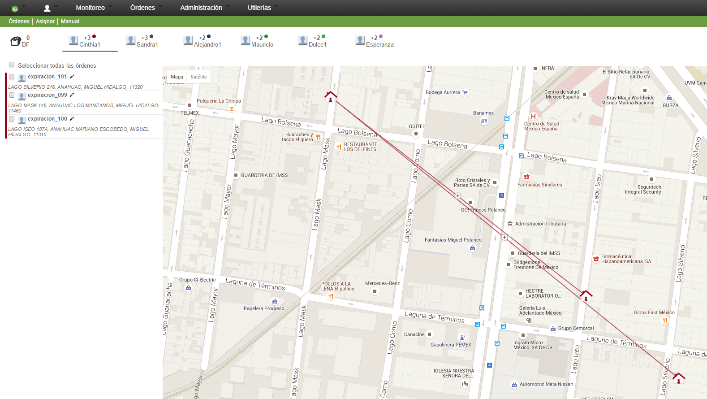

- Mover órdenes de un usuario a otro  
  
Mueve las posibles órdenes a asignar de un usuario a otro, para ello se deben seleccionar dos usuarios.   
  
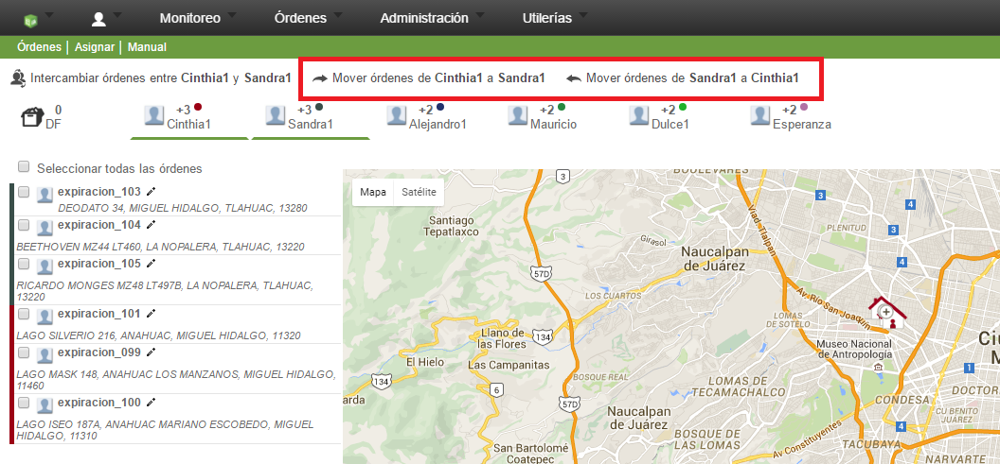
- Intercambiar órdenes de usuarios  
  
Intercambia las posibles órdenes a asignar de 2 usuarios, para ello se deben seleccionar dos usuarios.  
  
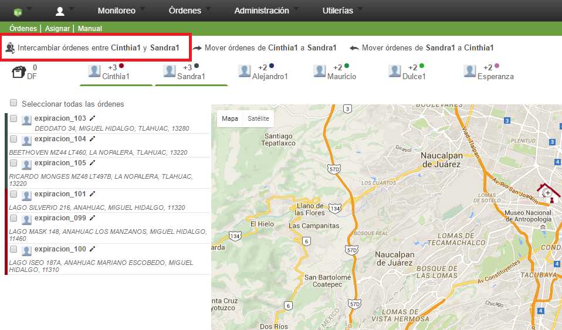
- Editar la dirección de una orden  
  
Edita la dirección de una orden, por si esta se asignó con una dirección diferente o errónea.  
  
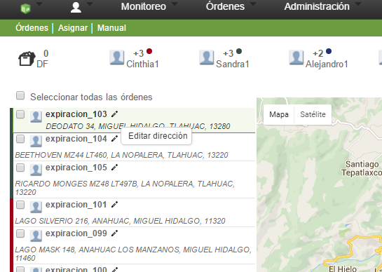
  
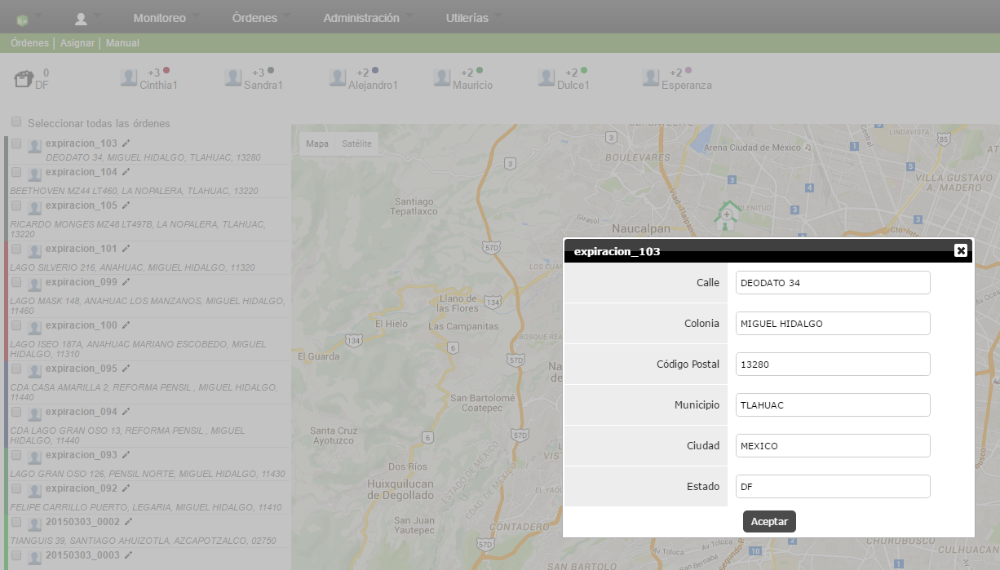
