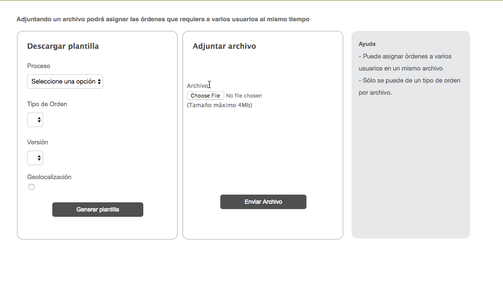

# Asignar En Paquete

Se asignan órdenes por medio de un archivo de hoja de datos. Aquí se puede descargar una plantilla para llenar, en la que se especifican los datos requeridos para mandar la orden, en ésta se pueden asignar varias órdenes, especificando sus datos en cada fila. El archivo que se descarga es de tipo "xlsx". También se puede subir el archivo de asignación, el cual debe ser de formato excel, con todos los datos requeridos correctamente llenados. Cuando éste no tiene los requerimientos necesarios, manda como respuesta otro archivo que especifica en qué se ha equivocado uno; cuando todo está correcto, se envía una respuesta con las órdenes asignadas. La pantalla donde todo esto es pedido se muestra en la **Imagen 4**, mientras que los campos se describen en la **Tabla 2.**

**Tabla 2.** Campos Pedidos en Asignación por Paquete.

| Campo | Descripción del campo | Requerido |
| --- | --- | --- |
| id - Identificador Externo | ExternalId que se asignará a la orden. | <ul class="inline-task-list" data-inline-tasks-content-id="36929549"><li class="checked" data-inline-task-id="1"> </li></ul> |
| userName - Asignada a | Usuario al que se asignará la orden. | <ul class="inline-task-list" data-inline-tasks-content-id="36929549"><li class="checked" data-inline-task-id="2">Cuando no asigna un grupo.</li></ul> |
| grupoExternalId - Id del grupo | Grupo al cual se asignará la orden. | <ul class="inline-task-list" data-inline-tasks-content-id="36929549"><li class="checked" data-inline-task-id="3">Cuando no se asigna un usuario.</li></ul> |
| expirationDate - Fecha de Expiración | Fecha y hora en la cual la orden expira. | <ul class="inline-task-list" data-inline-tasks-content-id="36929549"><li class="checked" data-inline-task-id="4"> </li></ul> |
| assignationDate - Fecha de Asignación | Fecha y hora en la cual se asignará la orden. | <ul class="inline-task-list" data-inline-tasks-content-id="36929549"><li data-inline-task-id="5"> </li></ul> |
| cancellationDate - Fecha de Cancelación | Fecha y hora en la cual se cancelará la orden. | <ul class="inline-task-list" data-inline-tasks-content-id="36929549"><li data-inline-task-id="6"> </li></ul> |
| priority | Valor numérico que indica la posición de la orden en la ruta de un usuario. En delivery se ocupa este campo para la creación de la ruta, se hace un "order by" de acuerdo al dato que contenga la orden. Si en delivery no mandan el dato de todas formas las órdenes se agregarán a la ruta pero sin un orden específico o no uno que se pueda controlar. | <ul class="inline-task-list" data-inline-tasks-content-id="36929549"><li data-inline-task-id="18"> </li></ul> |
| Nombre | Nombre de la Persona (Ejemplo: cliente final)  | <ul class="inline-task-list" data-inline-tasks-content-id="36929549"><li class="checked" data-inline-task-id="7"> </li></ul> |
| Calle | Calle donde se ubicará la orden. | <ul class="inline-task-list" data-inline-tasks-content-id="36929549"><li class="checked" data-inline-task-id="8"> </li></ul> |
| Colonia | Colonia donde se ubicará la orden. | <ul class="inline-task-list" data-inline-tasks-content-id="36929549"><li class="checked" data-inline-task-id="9"> </li></ul> |
| Codigo Postal | Código Postal de donde se ubicará la orden. | <ul class="inline-task-list" data-inline-tasks-content-id="36929549"><li class="checked" data-inline-task-id="10"> </li></ul> |
| Muncipio | Municipio de donde se ubicará la orden. | <ul class="inline-task-list" data-inline-tasks-content-id="36929549"><li class="checked" data-inline-task-id="11"> </li></ul> |
| Ciudad | Ciudad de donde se ubicará la orden. | <ul class="inline-task-list" data-inline-tasks-content-id="36929549"><li class="checked" data-inline-task-id="12"> </li></ul> |
| Estado | Estado de donde se ubicará la orden. | <ul class="inline-task-list" data-inline-tasks-content-id="36929549"><li class="checked" data-inline-task-id="13"> </li></ul> |
| Latitud (Se genera en el archivo de excel si se activa el check Geolocalización) | Latitud de donde se encontrará la orden. | <ul class="inline-task-list" data-inline-tasks-content-id="36929549"><li data-inline-task-id="14"> </li></ul> |
| Longitud (Se genera en el archivo de excel si se activa el check Geolocalización) | Longitud de donde se encontrará la orden. | <ul class="inline-task-list" data-inline-tasks-content-id="36929549"><li data-inline-task-id="15"> </li></ul> |
| Titulo de la orden (Se genera en el archivo de excel si el formato tiene habilitado el Titulo para contestar orden activado) | Titulo con el que aparecera la orden al contestar. | <ul class="inline-task-list" data-inline-tasks-content-id="36929549"><li data-inline-task-id="19">&nbsp;</li></ul> |

# **Notas:**

1. ## Si no se ingresan las coordenadas se intenta geocodificar con la dirección, en caso de contar con las coordenadas se toman y no geocodifica la dirección.
2. ## Las órdenes no se añaden a ruta si se asigna a un grupo y no a un usuario (sólo aplica para usuarios delivery).
3. ## Mas de 90 órdenes para añadir a ruta son mas de 4k que es el limite máximo que se permite en las push notification y si lo rebasan, no va a funcionar (sólo aplica para usuarios delivery).
4. ## También se puede contar con otros parámetros además de estos campos que pueden precargarse si un campo (widget) cuenta con diccionario (Id de prellenado).
5. ## Para el ordenamiento a ruta si se asigna un paquete y se desea ordenar la ruta todas las órdenes deberán contar con el parámetro lleno, es decir no pueden ir algunas con el parámetro vacío ya que no se realizaría el ordenamiento correctamente.
6. ## Si el formato no tiene activo el Titulo para la orden el campo (Titulo de la orden) no se descargara en el archivo.

**Imagen 4.**Pantalla de Asignación de Orden En Paquete.