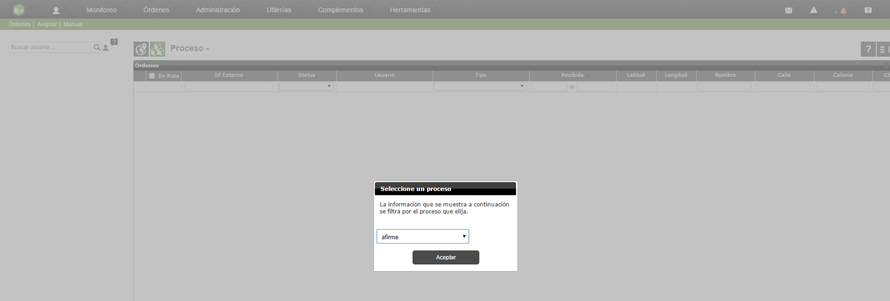
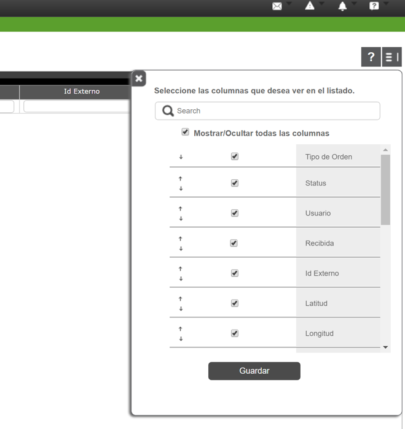
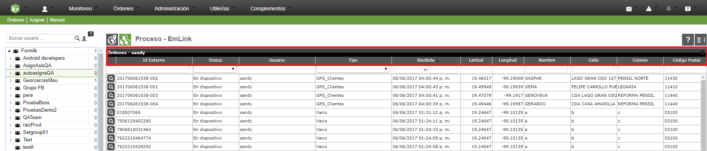
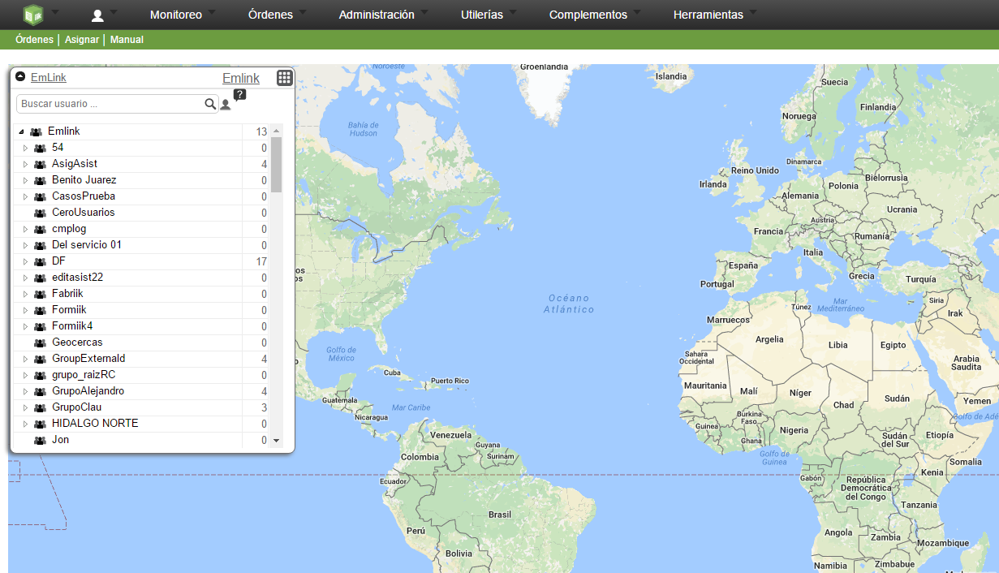
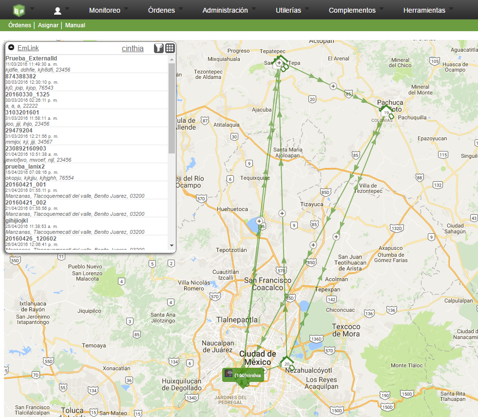
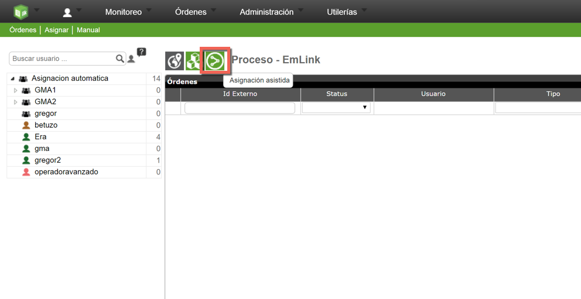

# Asignacion Manual

Permite asignar, reasignar, u enviar órdenes a ruta ya sea desde una vista de tabla o vista en mapa de las órdenes correspondientes a un grupo o usuario de formiik.

Para realizar esto primeramente se debe seleccionar un proceso para poder trabajar sobre los usuarios, grupos y órdenes correspondientes. Esto se elige al ingresar en el menú " Órdenes | Asignar | Manual " como se muestra en la siguiente imagen:

Una vez seleccionado el proceso se puede trabajar en las siguientes vistas:

## Vista Grid

Es la primer vista a la que se ingresa una vez seleccionado el proceso sobre el cual se va a trabajar.

**Funcionalidades**  
  
  
**a) Configuración de columnas:**  
  
Se configuran las columnas que se desean ver en la vista tabla respecto a los datos de una orden  
  

  
  

  
**b) Reasignar**  
**Puede ser de dos formas:**  
 – Dando clic derecho sobre una orden.  
 – Arrastrándola a otro usuario o grupo que se encuentre en la lista que se encuentra en la parte izquierda.  
**c) Cancelar órdenes**  
 – Se cancelan todas las órdenes seleccionadas, para ello se debe seleccionar toda la fila.  
**d) Filtrar**  
 – Se puede realizar un filtro por orden del listado realizando una búsqueda en ciertas cajas de texto o combos que se encuentran debajo de las columas; por ejemplo por Externalid, Status, Tipo de orden, parámetros como calle, colonia, etc.  
  
**e) Calcular la posición de una orden.**  
– Si al momento de asignar una orden no se pudo calcular sus coordenadas, al entrar en la vista mapa se intenta geoposicionar para ello se necesitaría contar con el servicio "Autogeocoding on map".

## Vista Mapa

- Se accede a la vista de mapa dando clic en el siguiente icono:   
  

  
Una vez ingresando se muestra de la siguiente manera:   
  

  
Para realizar acciones como reasignar, agregar a ruta se debe seleccionar una persona o grupo y posteriormente se muestran en el mapa las órdenes con las que se cuenta. (Solo se muestran órdenes con coordenadas válidas).  
  

  
**Funcionalidades**  
**a) Enviar a ruta**  
 – Agrega una orden de un usuario a ruta. Se realiza dando clic derecho sobre la orden.**b) Quitar de Ruta**  
 – Quita la orden de ruta de un usuario. Se realiza dando clic derecho sobre la orden.  
**c) Quitar de usuario/grupo**  
 – Quita la orden de un usuario o grupo reasignandola al grupo padre. Se realiza dando clic derecho sobre la orden.**d) Enfocar aquí**  
 – Hace un zoom al mapa enfocando el área sobre la orden seleccionada. Se realiza dando clic derecho sobre la orden.  
**e) Entrar al visor de la orden**  
 – Entra al visor de la orden cuando se da clic sobre una orden en el mapa.  
  

## Asignación Asistida
    
Éste botón sólo aparece cuando el grupo tiene configurado un algoritmo de asognación.

Ésta funcionalidad permite asignar órdenes a usuarios utilizando diferentes estrategias de asignación.

Los pasos son:

1. Configurar el grupo con la estrategia.
2. Asignar órdenes al grupo.
3. Solicitar distribución/asignación de órdenes del grupo entre los usuarios del mismo.
4. Aplicar asignación.

