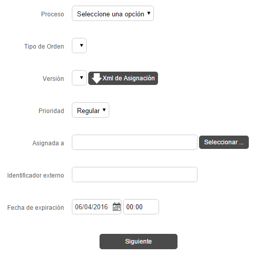
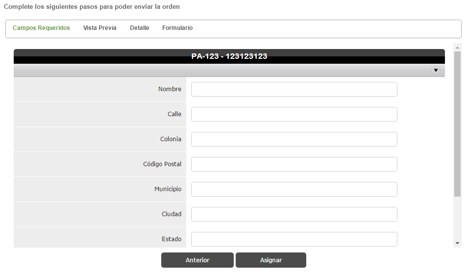
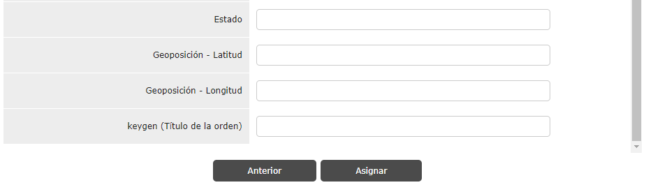

# Asignar Solo Una

Cuando se asigna sólo una orden se piden los datos que se observan en la**Imagen 2**. En estos se especifican el proceso, la orden, versión, prioridad, el asignado, identificador externo y las fechas de asignación, expiración y cancelación, todos descritos en la **Tabla 1**. Después de dar todos los datos, se pasa a una pantalla donde se especifican los datos de la orden como nombre y dirección asignados; además de los datos de prellenado y se pueden ver la vista previa y a detalle, como se muestra en la **Imagen 3.**

**Tabla 1.** Parámetros Descritos para Asignación de Una Orden.

| Parámetro | Descripción | Requerido |
| --- | --- | --- |
| Proceso | Proceso del cual se tomará el formato para asignar la orden. | <ul class="inline-task-list" data-inline-tasks-content-id="36929545"><li class="checked" data-inline-task-id="1"> </li></ul> |
| Tipo de Orden | Formato que se usará para la orden. | <ul class="inline-task-list" data-inline-tasks-content-id="36929545"><li class="checked" data-inline-task-id="2"> </li></ul> |
| Versión | Versión del formato. | <ul class="inline-task-list" data-inline-tasks-content-id="36929545"><li class="checked" data-inline-task-id="3"> </li></ul> |
| Prioridad | Prioridad que se le da a la orden. Esta puede ser Alta, Regular, Media, Baja. | <ul class="inline-task-list" data-inline-tasks-content-id="36929545"><li class="checked" data-inline-task-id="4"> </li></ul> |
| Asignada a | Usuario al cual se asignará la orden. | <ul class="inline-task-list" data-inline-tasks-content-id="36929545"><li class="checked" data-inline-task-id="5"> </li></ul> |
| Indentificador Externo | Campo alfanumérico con el cual se identifica la orden. Mayormente conocido como ExternalId | <ul class="inline-task-list" data-inline-tasks-content-id="36929545"><li class="checked" data-inline-task-id="6"> </li></ul> |
| Fecha de Asginación  | Fecha y hora en la que se asignará la orden. | <ul class="inline-task-list" data-inline-tasks-content-id="36929545"><li data-inline-task-id="7"> </li></ul> |
| Fecha de Expiración | Fecha y hora en la que la orden expira. Debe ser mayor a la fecha de asignación | <ul class="inline-task-list" data-inline-tasks-content-id="36929545"><li class="checked" data-inline-task-id="8"> </li></ul> |
| Fecha de Cancelación | Fecha y hora en la cual la orden se cancelará. Debe ser mayor a la fecha de expiración. | <ul class="inline-task-list" data-inline-tasks-content-id="36929545"><li data-inline-task-id="9"> </li></ul> |
| Nombre | Nombre de la Persona (Ejemplo: cliente final)  | <ul class="inline-task-list" data-inline-tasks-content-id="36929545"><li class="checked" data-inline-task-id="10"> </li></ul> |
| Calle | Calle donde se ubicará la orden. | <ul class="inline-task-list" data-inline-tasks-content-id="36929545"><li class="checked" data-inline-task-id="11"> </li></ul> |
| Colonia | Colonia donde se ubicará la orden. | <ul class="inline-task-list" data-inline-tasks-content-id="36929545"><li class="checked" data-inline-task-id="12"> </li></ul> |
| Código Postal | Código Postal de donde se ubicará la orden. | <ul class="inline-task-list" data-inline-tasks-content-id="36929545"><li class="checked" data-inline-task-id="13"> </li></ul> |
| Municipio | Municipio de donde se ubicará la orden. | <ul class="inline-task-list" data-inline-tasks-content-id="36929545"><li class="checked" data-inline-task-id="14"> </li></ul> |
| Ciudad | Ciudad donde se ubicará la orden. | <ul class="inline-task-list" data-inline-tasks-content-id="36929545"><li class="checked" data-inline-task-id="15"> </li></ul> |
| Estado | Estado donde se ubicará la orden. | <ul class="inline-task-list" data-inline-tasks-content-id="36929545"><li class="checked" data-inline-task-id="16"> </li></ul> |
| Latitud | Latitud donde se ubicará la orden. | <ul class="inline-task-list" data-inline-tasks-content-id="36929545"><li data-inline-task-id="17"> </li></ul> |
| Longitud | Longitud donde se ubicará la orden. | <ul class="inline-task-list" data-inline-tasks-content-id="36929545"><li data-inline-task-id="18"> </li></ul> |
| Titulo de la orden | Nombre con el que se mostrara al momento de editar (Cuando tiene el TitleForEdit configurado) | <ul class="inline-task-list" data-inline-tasks-content-id="36929545"><li data-inline-task-id="23"> </li></ul> |
| Vista Previa | Datos relevantes de la orden que se pueden prellenar por Diccionario (id de prellenado - Dictionary) | <ul class="inline-task-list" data-inline-tasks-content-id="36929545"><li data-inline-task-id="19"> </li></ul> |
| Detalle | Datos relevantes de la orden que se pueden prellenar por Diccionario (id de prellenado - Dictionary) | <ul class="inline-task-list" data-inline-tasks-content-id="36929545"><li data-inline-task-id="20"> </li></ul> |
| Formulario | Campos del formato con Diccionario (id de prellenado - Dictionary) que se pueden prellenar | <ul class="inline-task-list" data-inline-tasks-content-id="36929545"><li data-inline-task-id="21"> </li></ul> |

**Imagen 2.**Selección de la orden para asignar.

**Imagen 3.**Datos de la orden.

**NOTA.**

- Para poder visualizar el campo de (Título de la orden) el formato debe tener configurado el TitleForEdit cambio aplicado en la version 4.20