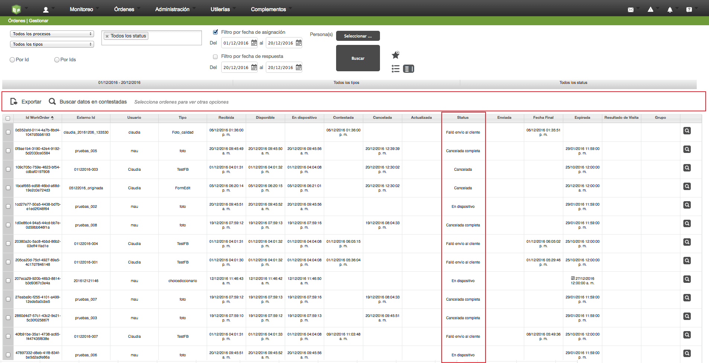

## Barra de Acciones del Gestor de Ordenes

**Paradigma anterior:** En el módulo del Gestor de Órdenes dentro de Formiik Web se tiene una barra de acciones que operan sobre las órdenes que se están mostrando, cuando se crea una nueva acción esta se agrega al final de la barra de acciones lo que ocasiona que se tenga una saturación de botones que puede incluso no llegar a visualizarse en pantallas donde la resolución es menor.

**Solución:** Se propone que los botones de acción sólo vayan apareciendo conforme al estado de las órdenes que están siendo seleccionadas de tal forma que una selección múltiple con varios estados creará una exclusión mostrando en la barra de acciones aquellas que apliquen para los estados de las órdenes seleccionadas. La acción de Exportar y de Buscar Contestadas siempre deberán de mostrarse.

La pantalla propuesta quedaría de la siguiente manera:

A continuación se en listan las acciones y cuando deben de aparecer en base al estado de las órdenes que se seleccionaron:

"**Buscar datos en contestada**s": aparece siempre, pues es una sub-búsqueda sobre el filtro principal, no sobre las órdenes seleccionadas.

|     | Cancelar | Reenviar Respuestas | **Reenviar al Dispositivo** | Reenviar Incompletas | Reasignar Órdenes | Reenvió de Canceladas  (super user)  |
| --- | --- | --- | --- | --- | --- | --- |
| Recibida | X |     |     |     |     |     |
| A disposición | X |     |     |     | X |     |
| En dispositivo | X |     | X |     | X |     |
| Actualizada | X |     |     |     | X |     |
| Respuesta |     |     |     | X |     |     |
| Cancelada |     |     |     |     |     | X |
| Cancelada completa |     |     |     |     |     | X |
| Enviada al cliente |     | X |     |     |     |     |
| Fallo de envío al cliente |     | X |     | X |     |     |
| Respuesta completa |     |     |     |     |     |     |
| Fallo de recepción de archivos |     |     |     | X |     |     |

**NOTA: El boton para exportar no aparecera hasta que se realice alguna busqueda, una vez realizada la busqueda el boton se hara visible para todas las ordenes en cualquier status.**