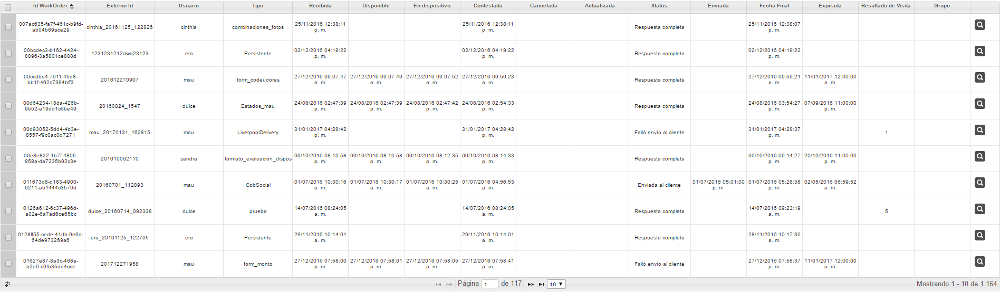

# Resultados de una consulta en el gestor

Al realizar una consulta en el gestor se muestran el estado en el que están las órdenes así como las fechas y horas correspondientes por los que ha pasado dicha orden.

La información se presenta a través de un grid/tabla con una columna para cada uno de los estados, así como elementos principales de la orden como Externalid, Usuario, Tipo de orden , etc.

Dichas columnas pueden configurarse para mostrar solo los estados o información de la orden que se requiera.

