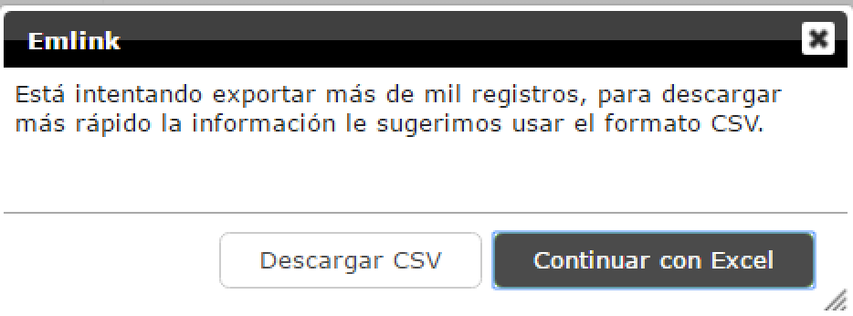

# Exportar contestadas a excel

La exportación de las contestadas genera un archivo en excel con órdenes en estatus "Enviada al cliente", "Respuesta completa", "Falló envío al cliente", "Fallo al recibir archivos", "Respuesta". Si se tienen órdenes en estatus diferentes a los antes mencionado cuando se descarguen las contestadas a excel estas serán descartadas.

Columnas que se descargan: Las de default, pero no las establecidas en la parte de configuración de columnas.

Visualización de Columna "Respuesta Completa" en descarga de respuesta  Historia  se pretende que se puedan descargar las establecidas desde las configuración de columnas. Aun pendiente por desarrollar.

Lo recomendable para descargar en excel son 1000 órdenes, si se rebasa esa cantidad aparecerá el msj "Está intentando exportar más de mil registros, para descargar más rápido la información le sugerimos usar el formato CSV", se puede continuar con la descarga en excel si se desea.

Cuando este issue [FOR-6656] sea liberado, la exportación de las respuestas va a funcionar de la siguiente manera:

1. Cuando se seleccione el check de "Exportar sólo órdenes seleccionadas", va a exportar únicamente las seleccionadas que cumplan con el estatus "Enviada al cliente", "Respuesta completa", "Falló envío al cliente", "Fallo al recibir archivos", "Respuesta", si en el filtro existiera otra en ese estatus pero no esta seleccionada no se va a exportar.
2. En caso de que no se seleccione el check de "Exportar sólo órdenes seleccionadas" va a seguir funcionando como antes, aunque se tengan órdenes marcadas.

**Campos exportables en Gestor configurables si son sensibles**

Las respuestas pueden contener datos que son sensibles para algunos roles, por eso surge el requerimiento  - Campos exportables en Gestor configurables si son sensibles Historia

###### *Configuración:*

En el storage center general de cada cliente existe la tabla "ExportPermissions" dentro de esta se debe configurar:

<u><em>PartitionKey</em></u> El idclient (Todo en minúsculas)

<u><em>RowKey</em></u> Para**configuración default**, el id del permiso más el rol, ejemplo: "NonExportableColumns\_Administrator"

Para **configuración especifica** por formato, id del formulario de la tabla workorderformtype más el id del permiso más el rol, ejemplo: d7f1009b-d51b-4c5c-bf77-6d9febb36177\_NonExportableColumns\_Administrator

**NOTA:**

*-Cuando es configuración por default en la tabla se deben agregar todas las columnas incluyendo “IdWorkOrderFormType" (se debe dar un espacio en blanco)**y “NonExportableColumnsFormEdit” (se debe poner **{}**) indicando que existen esas columnas en la configuración pero estan vacias.*

*-Al configurar los valores de la columnas, NO deben existir valores duplicados, si hay valores duplicados en la exportación marcara un error. Por ejemplo {"FormEdit2":["TextEdit2",**"TextEdit1","TextEdit1"**]}.*

*-El id del permiso siempre tiene que ser "NonExportableColumns" y el Role debe colocarse como está en la tabla de Role, columna RoleSystemName, el dato para el RowKey es Case sensitive por lo que deben seguirse las anteriores indicaciones.*

<u><em>Timestamp</em></u> lo da por default

<u><em>ClientId</em></u> mismo dato que PartitionKey

<u><em>IdPermissionandRole</em></u> mismo dato que RowKey

<u><em>IdWorkOrderFormType</em></u> es el id del formulario de la tabla WorkOrderFormType en minúsculas, si la configuración es default este dato debe de venir vacío

<u><em>NonExportableColumns</em></u> es formato Json, el cual debe contener las columnas que no se van a exportar, los nombre de las columnas son los KeyForSave de los widgets excepto las columnas default que tiene por id: idWorkOrder, externalId, AssignedTo, FormType, Received, Available, InDevice, Answered, Canceled, Updated, StateNumber, ChangeStateDate, FinalDate, ExpirationDate, VisitResult, GroupName, FailedToSentToClient, AnswerComplete, FailedToReceiveFiles. Para el caso especifico de los ***CheckButton*** que pueden llegar a tener muchos KeyForSave se tomara el "Field Name"

*<u>NonExportableColumnsFormEdit</u>* es formato Json, el cual debe contener las columnas que no se van a exportar para los formedit, los nombre de las columnas son los KeyForSave, la columna default para los formedit no se puede ocultar debido a que es la que da la relación con la orden del formato principal

Ejemplo para NonExportableColumns y NonExportableColumnsFormEdit:

NonExportableColumns: ["Nombre","Calle","idWorkOrder"]

NonExportableColumnsFormEdit: {"FormEdit2":["TextEdit1"],"FormEdit1":["TextEdit1","DateTimeEdit1","TextEdit2"]}

Si sólo se desea no exportar columnas del formato padre únicamente llenar NonExportableColumns y viceversa, si sólo se quiere no exportar columnas del formedit únicamente llenar NonExportableColumnsFormEdit

**Nota:** Si ya se tiene un configuración para CSV no es necesario volver a agregar para Excel