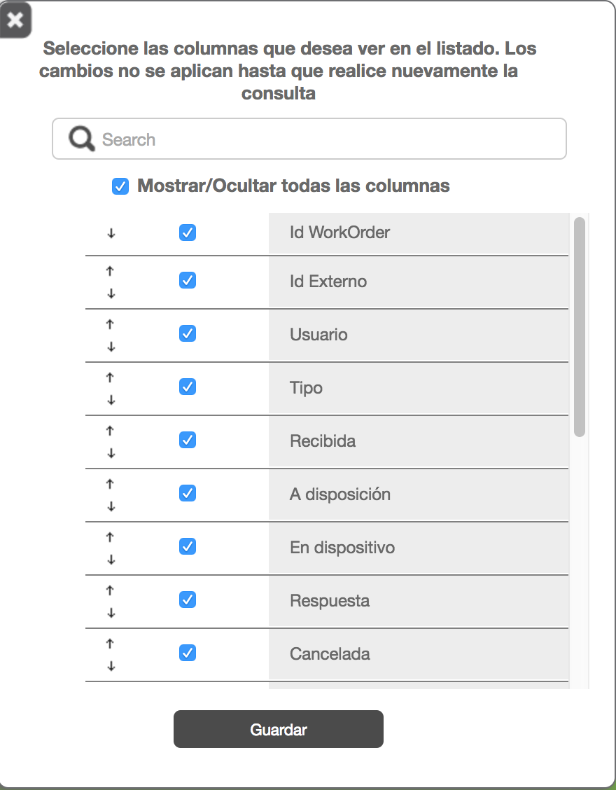

## Gestor

## Filtros del Gestor

| Nombre | Descripción |
| --- | --- |
| Proceso | La información se seleccionará en base al identificador del producto asignado a la orden de trabajo. El campo a seleccionar en base de datos es el **IdProduct** de la tabla **WorkOrder** de la base de datos.  Este filtro es de tipo lista desplegable y solo podrá seleccionar unos o Todos los productos  |
| Tipo | La información se seleccionará en base al identificador del tipo de Formato con el que se creo la orden de trabajo. Para ello contamos con un almacén de formatos en la base de datos en la tabla **WorkOrderType** la cual se enlaza a la orden a través del campo **IdWorkOrderType** de la tabla **WorkOrder** y se toma el nombre del formato con el campo **FullQualifiedName** de la tabla **WorkOrderType**  Este filtro es de tipo lista desplegable y solo podrá seleccionar unos o Todos los tipos  |
| Estatus | La información se seleccionará en base al identificador de estado de la orden de trabajo. Para lo cual se cuenta con un catálogo de estados de la orden en la base de datos (**WorkOrderState**). Este catálogo se enlaza a la orden a través del campo **state** de la tabla **WorkOrder** y se muestra el campo **StatusDescriptionEs** o **StatusDescriptionEn** dependiendo del idioma del navegador  Este filtro es de tipo lista desplegable y permite selección múltiple o Todos los Estatus  |
| Fecha de Recepción | Fecha en la que la orden fue creada en formiik . Para ello se utilizará el campo **ReceivedDate** de la tabla **WorkOrder**.  Para utilizar este filtro marque la casilla de verificación "Filtro de fecha de recepción"  Este filtro es de tipo Calendario y se podrá seleccionar una fecha de inicio y una fecha final, el sistema debe validar que no se pueda seleccionar fechas posteriores al día de la consulta (fecha de hoy) y que la fecha final no pueda ser menor a la fecha inicial  |
| Fecha de Respuesta | La información se seleccionará en base a que la fecha de respuesta de la orden de trabajo se encuentre en el rango de fechas seleccionado . Para ello se utilizará el campo **FinalDate** de la tabla **WorkOrderResponse**.  Para utilizar este filtro marque la casilla de verificación "Filtro por fecha de respuesta"  Este filtro es de tipo Calendario y se podrá seleccionar una fecha de inicio y una fecha final, el sistema debe validar que no se pueda seleccionar fechas posteriores al día de la consulta (fecha de hoy) y que la fecha final no pueda ser menor a la fecha inicial  |
| Persona | La información se seleccionará en base al usuario al cual pertenece o esta asignada la orden de trabajo. Para ello nos auxiliamos del visor de usuarios, el cual es un componente que muestra en forma de árbol los Grupos disponibles y sus usuarios contenidos.  Se cuenta con un catálogo de usuarios en la tabla **User** de la base de datos, el cual se conecta a la orden por medio del campo **AssignedTo** de la tabla **WorkOrder**  |
| Por Id | La información se seleccionará en base al Identificador Externo de la orden de trabajo. Para ello nos auxiliaremos del campo **ExternalId** del la tabla **WorkOrder**  Si se van a utilizar las cajas de verificación de "Filtro de fecha de recepción" y "Filtro por fecha de respuesta" se debe conocer la fecha fue recibida en formiik y que fue contestada, según sea el caso de la fecha que se seleccione  Se muestran las ordenes que coincidan con este valor y que pertenezcan al grupo o algún subgrupo del usuario al cual pertenece la orden de trabajo  S**e añade una nueva funcionalidad de que al consultar por el identificador externo recuperara las ordenes que coincidan con este valor y ademas que:**  **1.- La orden tenga asignado un usuario que no pertenezca al catálogo de usuarios de la base de datos (usuario inexistente)**  |
| Por Ids | Es igual que la funcionalidad de "Por Id" solo que ésta busca por varios Ids, basta colocar en la caja de texto los id separados en diferentes renglones para que realice la búsqueda |
|Fecha de asignación|El filtro aparece siempre y cuando el cliente tenga configurado IsEnableFilterAssignDate en Configuracion de Cliente|
| Buscar | Es el botón que al presionar ejecuta el filtro seleccionado.  Nota: Para hacer exportaciones de los diferentes archivos no es necesario presionar el botón de "Buscar", basta con seleccionar un filtro y exportar el archivo que se desea, en automático al descargar aplica el último filtro.  |

## Acciones en el gestor

Los botones de acciones son visibles, dependiendo de las órdenes consultadas y seleccionadas.

A continuación se lista cuando debe aparecer cada acción en el gestor.

| Botón | Modo de aparecer |
| --- | --- |
| **Cancelar** | Se debe seleccionar una orden con status de Recibida, A disposición, Actualizada y En dispositivo. |
| **Reenviar Respuesta** | Se debe seleccionarse una orden que esté en status Enviada al cliente o Falló envío al cliente. |
| **Reenviar al dispositivo** | debe seleccionarse una orden con el status En dispositivo o Actualizada. |
| **Reenviar canceladas** | Permite reenviar órdenes que está en estatus cancelado a dispositivo, Debe seleccionarse una orden con el status Cancelada y Cancelada Completa y el usuario debe ser SuperUser. |
| **Reasignar órdenes** | Debe seleccionarse una orden con status A disposición y En dispositivo y el usuario debe ser SuperUser. |
| <ul><li>Nota: Si son órdenes con diferente status debe aparecer solo los botones que tienen en común.</li></ul> |

Dentro del gestor existe una barra se operaciones que se aplican a la información recuperada por la consulta principal.

A continuación se presenta un resumen de estas.

| Operación | Descripción |
| --- | --- |
| Cancelación | Cancela las ordenes con status de Recibida, A disposición, Actualizada y En dispositivo |
| Re-envío de Repuesta | Re-envía las ordenes con status de Enviada al cliente o Falló envío al cliente.  Para las ordenes con status de Falló envío al cliente se determina si ya tienen todas las fotos en cuyo caso se envía al QueueResponseComplete poniendo la orden en estatus de AnsweredCompleted, en caso de que no estén todas las fotos se envía al QueueResponse y se coloca la orden al estatus Answered.  Para el caso de las ordenes en estatus SentToClient se envían directo al QueueResponseComplete dejando la orden en estatus de AnsweredCompleted  |
| Re-enviar a dispositivo | Reenvía las órdenes en status de **En dispositivo**cancelando las órdenes que están en dispositivo y creando una copia con otro idworkorder para que vuelva a bajar al dispositivo. Siempre y cuando no tengan status de Respuesta, Respuesta completa, Cancelada, Cancelada completa o bien la orden cuente con la propiedad de Originada; para el caso de que una orden sea originada solo se cancela. |
| Buscar datos en las respuestas | Realiza la búsqueda de una cadena de texto dentro del xml de respuesta de la orden |
| Exportar | Realiza la exportación de todas las ordenes resultado de la consulta  Esta se divide en  Exportación de parámetros el cual se envía a un archivo de tipo excel  Exportación de las ordenes resultado de la consulta principal el cual se envía en el formato de archivo csv y en excel  Exportación de respuestas. De aquí se puede exportar el xml tal como se almacena la respuesta, en archivo excel, csv o pdf  |
| Re-enviar incompletas | Re-envía las respuestas en estado de Respuesta o Falló envío al cliente hacia el QueueResponseComplete |
| Reasignar Órdenes | Reasigna órdenes de un usuario a otro. La orden debe estar en los estatus A disposición y En dispositivo. Ésta opción solo puede utilizarla un usuario de tipo superusuario. [Ver Roles y permisos Web](/Confluence/Inicio/Documentacion%20de%20Seguridad/Seguridad%20Formiik/Roles%20y%20Permisos%20en%20Web).  |
| Re-enviar Canceladas | Re-envía las órdenes en status Cancelada y Cancelada Completa, creando una copia con otro idworkorder para que vuelva a descargar en el dispositivo.  Esta acción solo puede realizarse siempre y cuando, no hayan pasado más de dos días que se canceló. Ésta acción se realiza con el fin de que si se cancela una orden por error, se tiene máximo dos días para reenviarla al dispositivo.  **Importante:**<u>Esta opción sólo estará disponible para un perfil de Super Usuario</u>  |

## Columnas

### Configuración de columnas

La configuración de columnas a ver en el grid al realizar una consulta se realiza al dar clic en el siguiente botón 

Después de dar clic en el botón se abre una modal en donde se pueden seleccionar o des-selecionar las columas para únicamente ver las que se desean al realizar una consulta. Nota: debe tenerse al menos seleccionada una columna seleccionada para poder aplicar cambios y realizar consultas.

- Imagen de la configuración de columnas

Y para aplicar los cambios se debe dar clic en el botón guardar ya que si se da clic en el icono X se lanza una advertencia que indica que cualquier cambio no guardado no se aplicará.

| Nombre de la columna | Descripción |
| --- | --- |
| Id Workorder | Identificador interno de una orden de formiik (formato guid). |
| Id Externo | Identificador de una orden que asigna el cliente.  |
| Usuario | Nombre del usuario al cual está asignada la orden.  |
| Tipo | Tipo de orden (formato).  |
| Recibida | Fecha y hora (local) de creación de la orden en Formiik  |
| A disposición | Fecha y hora (local) de cuando la orden pasó a dicho estado o de la fecha y hora de la asignación futura si se asignó con dicho parámetro.   |
| En dispositivo | Fecha y hora (local) de cuando la orden pasó a dicho estado.  |
| Respuesta | Fecha y hora (local) de cuando la orden pasó a dicho estado. |
| Cancelada | Fecha y hora (local) de cuando la orden pasó a dicho estado o bien de la fecha y hora de cancelación futura si se asignó con dicho parámetro  |
| Actualizada | Fecha y hora (local) de cuando la orden pasó a dicho estado. |
| Status | Estado en el que se encuentra la orden. |
| Enviada al cliente | Fecha y hora (local) de cuando la orden pasó a dicho estado. |
| Respuesta Fin | Fecha y hora de cuando se guardó la respuesta de la orden. Esta fecha se toma de la tabla workorderresponse del campo finaldate. <ul><li>Es la fecha que manda Android de cuando se respondió la orden.</li></ul> |
| Expirada | Fecha y hora de expiración que se determinó al asignar la orden. |
| Resultado de Visita | Puntaje del resultado de un eval definido como forrmiikvalue en el formato, siempre deberá ser numérico. |
| Grupo | Grupo al cual está asignada la orden si es que no se asignó a un usuario en específico. |
| Fallo envío al cliente | Fecha y hora (local) de cuando la orden pasó a dicho estado. |
| Respuesta Completa | Fecha y hora (local) de cuando la orden pasó a dicho estado. |
| Fallo al recibir archivos | Fecha y hora (local) de cuando la orden pasó a dicho estado. |
| Fallo de asignación | Fecha y hora (local) enviada en la creación de la orden. |
 
