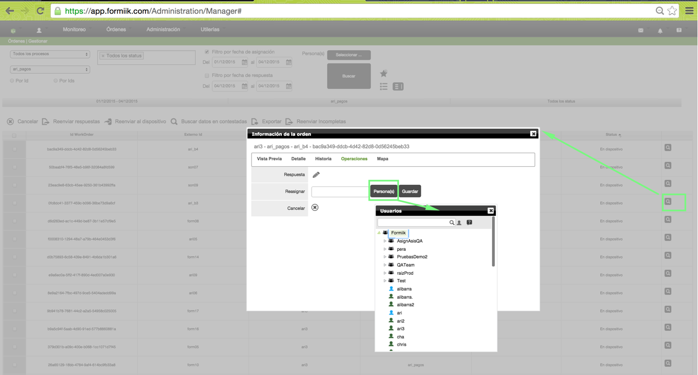

# Reasignacion

Pre condiciones:

La orden debe de estar en los estados de : a disposición o en dispositivo

*Tener en cuenta que si una orden está en dispositivo si no cuenta con los parámetros requeridos (Nombre, Calle, Colonia, C.P., Municipio, Ciuda, Estado) no podrá reasignarse.*

Desde la página del gestor de órdenes

1. Buscar la orden
2. Dar click en el visor de la orden
3. En la sección de operaciones, dar click en personas
4. Seleccionar el usuario operador "destino"
5. guardar

