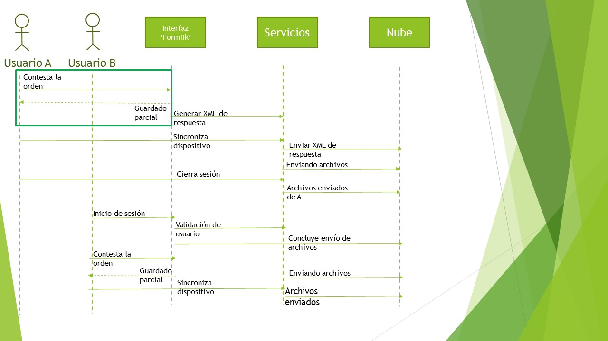
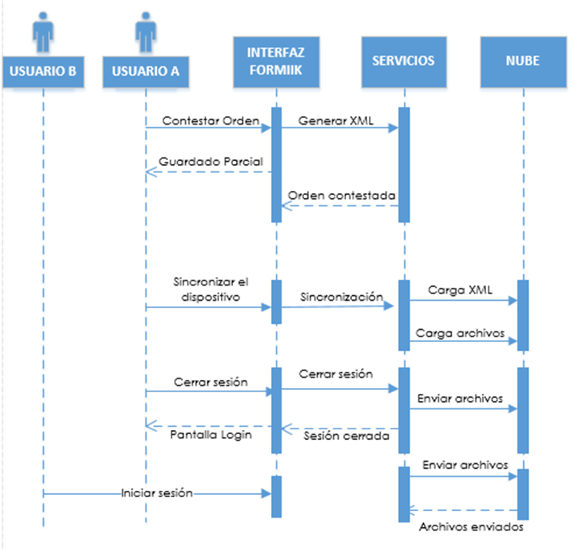
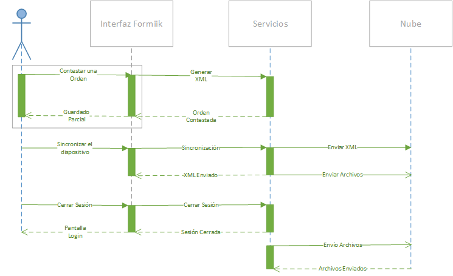

# Envio de archivos de una orden

El proceso de envío de archivos de una orden DEPENDE de una sesión activa de un usuario en la aplicación, por ejemplo:

## Caso de Uso 1.

* Si un usuario sincroniza el dispositivo y las órdenes contaban con fotos, finaliza la sesión de la aplicación.

## Caso de uso 2.

* Si un usuario sincroniza el dispositivo y las órdenes contaban con fotos, posteriormente se inicia sesión en el mismo dispositivo con otro usuario.

## Caso de uso 3.

* Si un usuario sincroniza el dispositivo y las órdenes contaban con fotos, posteriormente se inicia sesión en el mismo dispositivo con otro usuario y contesta órdenes con archivos.

Estos escenarios descritos siempre y cuando el dispositivo cuente con red de datos móviles o Wi-Fi.

## Almacenamiento en la nube de los archivos.

Los archivos de una orden se envían al blob del storage center en donde se encuentra el cliente en la blob response-files

cuando una orden terminada con estado de "En dispositivo" pasa a "Respuesta" al sincronizar el móvil.

## Almacenamiento Local.

Dichos archivos se almacenan en el dispositivo en la carpeta FormiikSync en la siguiente ruta: /storage/emulated/0/Android/data/formiik.com.mobiik.www/formiikSync

El nombre del archivo se conforma de la siguiente manera: idworkorder_nombre del widget.extensión del archivo.

## Limpieza de Archivos (Carpeta FormiikSync)

Los archivos se borrarán de la carpeta FormiikSync en los siguientes escenarios:

* Cuando se borra una orden en el tab de terminadas se encuentra en estado de Respuesta Completa, Enviada al cliente o Fallo de Envío al Cliente (Color Verde).
* Cuando se borra manualmente una orden en el tab de terminadas y se encuentra en estado de En Dispositivo (Color Rojo).
* Cuando se cancela una orden en el tab de terminadas y se encuentra en estado de En dispositivo (Color Rojo).
* Cuando se inicia sesión en la aplicación y los archivos de la carpeta FormiikSync no tienen referencia a alguna orden.