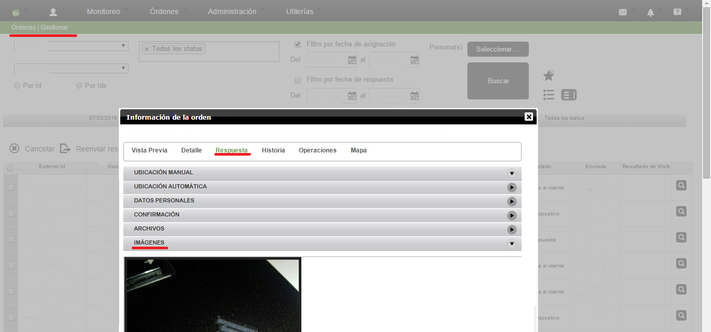
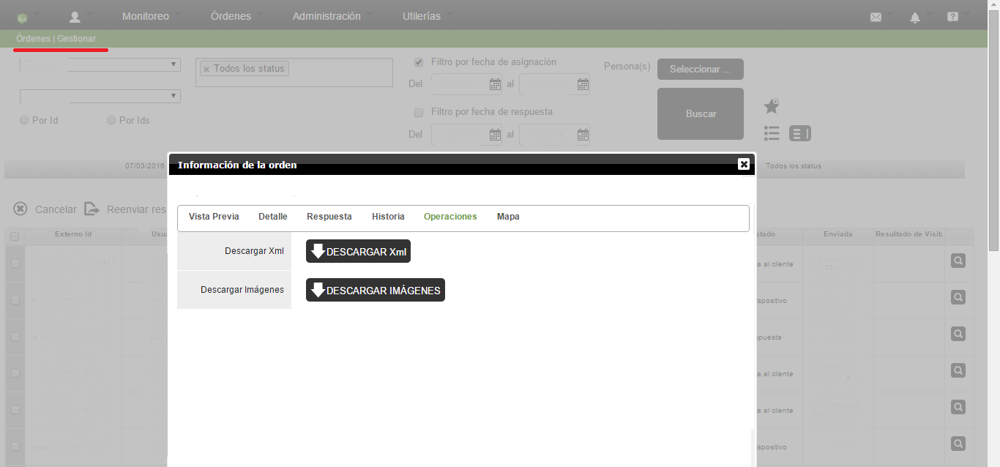

# Fotos Recibidas

Las fotos enviadas a través de un formulario se reciben en el servidor a través de un archivo blob. Éstas son especificadas en la respuesta con la ruta del archivo en el blob storage de Windows Azure, de tal forma que para accesar a ellas se tiene que acceder a dicha dirección. El dispositivo móvil sube los archivos a la nube de diferente manera que los datos de texto; mientras que los archivos pequeños son sincronizados a la primera oportunidad, los archivos más grandes, como imágenes o audio, son enviados aparte. Esto se observa por medio de los status de las órdenes temrinadas, tales como terminada, respuesta enviada y respuesta en cliente. Los anteriores puntos son simbolizados por medio de colores en la orden, rojo para datos llenados pero no enviados, amarillo para datos de texto enviados y archivos en espera de ser subidos o enviándose y por último verde para respuesta completa, que es cuando tanto la respuesta en xml como los archivos han sido recibidos en el servidor.

Los archivos de imagen tienen diferentes propiedades, las cuales son más ampliamente explicadas en la sección de Widgets, tales como resolución, nitidez o prioridad. La última indica la forma en que el dispositivo subirá el archivo a la nube, yendo de a-z, valores que indican la preferencia que tendrá el archivo para ser enviado.

En la "Información de la Orden", encontrada en la sección de "Gestor de Órdenes", se puede acceder a la pestaña de Respuesta, y ver en la subsección de Imágenes las fotos enviadas por el ususario.

Mientras que en la opción de descargar XML, se puede observar la respuesta del usuario en el formato "xml"; en dicho archivo se puede encontrar la ruta al blob que conforma la imagen, cada dirección es única para cada archivo de imagen que se haya subido al servidor.

En la Imagen 1 se puede observar en la parte superior la ruta seguida por el usuario para acceder a la tabla de respuestas de órdenes con ciertos filtros modificables. En ésta, se puede acceder a las respuestas, las cuales tienen varias opciones. En la imagen se observa la ventana desplegada, la cual tiene seleccionada la pestaña de "Respuesta", en la que se presionó la sección de "Imágenes", con lo que se abre un apartado donde aparecen las imágenes recibidas en el servidor, las cuales conforman parte de la respuesta del usuario.

En la Imagen2 se puede ver la misma ventana que ya se ha mencionado, sólo que en la pestaña de "Opercaciones". Ésta contiene dos opciones, "Descargar Xml" y "Descargar Imágenes"; mientras que la segunda descarga un archivo comprimido con los datos de las imágenes, el primero descarga el XML correspondiente a la respuesta, en el que se puede obtener la dirección donde está hospedado el blob de la imagen en el servidor.

