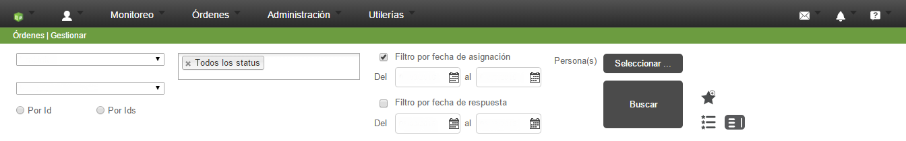
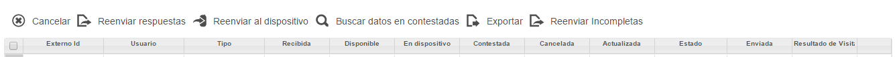

## Historial de la orden

Cuando un orden es asignada, ésta es inmediatamente subida a la base de datos y tiene un Status, fechas y horas, datos que se encuentran fácilmente en el historial de la orden. Éste puede consultarse en la página de Formiik, en la pestaña de "Órdenes" en la sección "Gestionar".

Dentro de este apartado, se puede observar un filtro para consultar las órdenes que se han asignado. Los campos incluyen el proceso, el formulario, Id de la orden (o varios), el estado de la orden, fecha y personas asignadas. En la Imagen 1 se muestran tales características.

Cuando se definen los filtros correspondientes, aparece una tabla conteniendo toda la información de la orden en varias columnas, incluyendo la respuesta. Además se muestran varias opciones que permiten realizar acciones específicas en las órdenes asignadas, tales como reenviar al dispositivo o cancelar. Lo anterior se puede ver en la Imagen 2.

Los diferentes estados en que una orden puede estar son los siguientes:

* Recibida. Se está procesando la orden para poder ser asignada.
* Disponible. La orden ha llegado a la base de datos y está lista para enviarse al dispositivo.
* En Dispositivo. Los datos de la orden han sido enviados al dispositivo.
* Contestada. También llamada Respuesta. La orden fue llenada en el dispositivo, está lista para enviarse a la nube en la siguiente sincronización.
* Respuesta Completa. La orden ha sido enviada a la nube, tanto el XML como los archivos adjuntos.
* Cancelada. La orden se canceló.
* Enviada al Cliente. La orden fue enviada al servidor del cliente por completo.
* Actualizada. La orden fue cambiada por un servicio de la web, esto sólo puede hacerse mientras la orden esté en dispositivo.
* En el dispositivo, la orden tiene diferentes pseudoestados que se pueden ver visualmente y ayudan al cliente a saber el flujo de los datos. Estos son los siguientes:

Órdenes no contestadas.
1. Nube Negra. La orden fue bajada al dispositivo pero faltan la definición de XML, la definición de alguna subforma o algún archivo por descargar.
2. Nube Verde. La orden está lista para contestarse.
3. Signo Adicional de Infinito. La orden es persistente.
4. Signo Adicional Rectángulo Amarillo. La orden tiene información guardada.

Órdenes contestadas
1. Fondo Rojo. La orden está contestada y lista para enviarse a la nube en la siguiente sincronización.
2. Fondo Amarillo. El XML ha sido enviado a la base de datos, faltan los archivos para enviarse (Estos serán enviados dependiendo de su configuración de prioridad).
3. Fondo Verde. La respuesta está completamente en la nube.