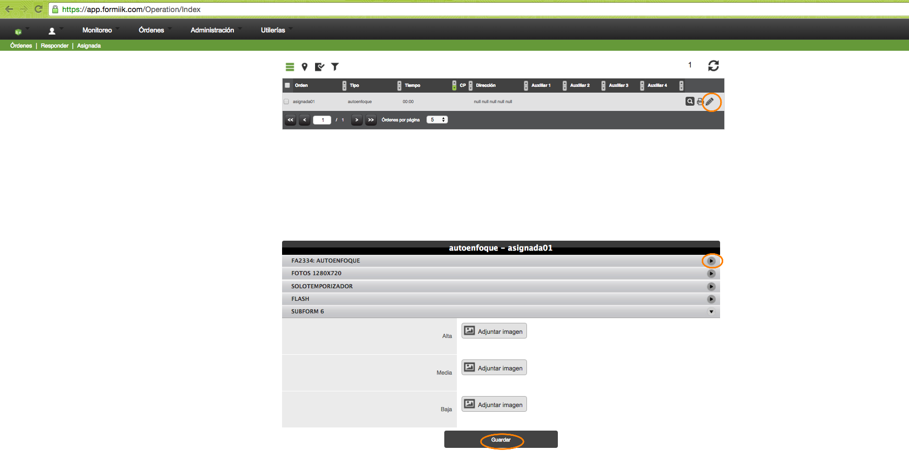
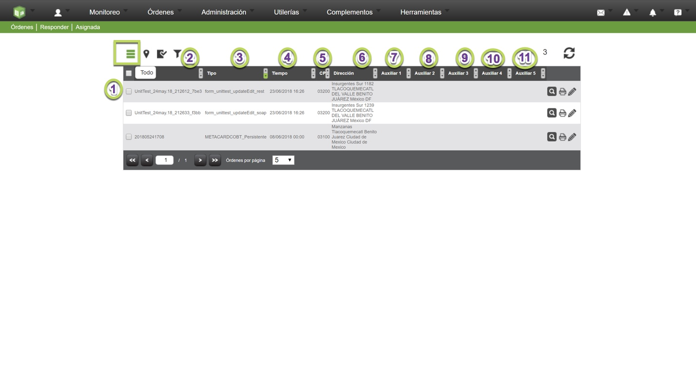
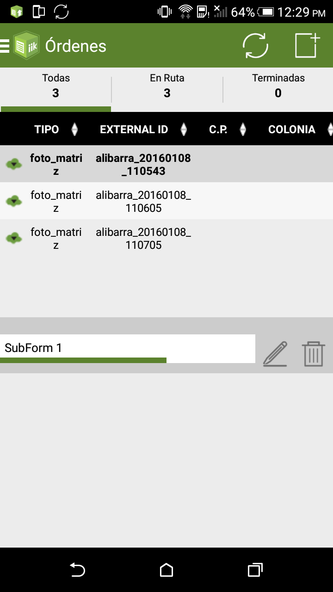

# Responder Ordenes

La respuesta de la orden en general se divide en: la información que se procesa como texto plano (Xml) y la que no se puede procesar y se adjunta (fotos u otro tipo de archivos).

También implica las características del formato y desde donde se responde; se puede responder mediante web o desde android.

## Desde Web

* Ingresando a la pantalla de orden\asignada \respuesta
* Se selecciona la orden y dar click en el icono de responder (lápiz)
* Llenar los campos de la orden
* Dar click en guardar

## Columnas

Desde Vista Todo:

Las columnas que se deben mostrar en esta sección son:
1. El check para determinar si se debe incluir la orden en la ruta del usuario
2. Orden, externalid con el que se asignó
3. Tipo de la orden
4. El tiempo, fecha de expiración de la orden
5. C.P. este dato es de los campos requeridos al asignar una orden
6. Dirección que se forma con los campos requeridos de Calle, Colonia, C.P., etc.
7. Auxiliar 1
8. Auxiliar 2
9. Auxiliar 3
10. Auxiliar 4
11. Auxiliar 5

**Columnas Auxiliares**: De la columna auxiliar 1 a la 5 se llenan dependiendo de lo configurado en Utilerías esta configuración es por formato y si algún formato de los asignados no tuviera configuración no se podría visualizar información. La configuración se toma al momento de hacer la asignación, por lo tanto, si algún formato fue configurado y luego se borro dicha configuración mientras se asignen órdenes esos valores no se van a almacenar hasta que se vuelvan a configurar. Todas las columnas anteriores siempre se muestran contengan o no información para mostrar.

## Desde android

* Seleccionar la orden
* Presionar el icono de respuesta (lápiz)
* Completar los campos del formato
* Presionar el icono de guardar (disquete)
* La orden se mostrará en el tab de "Terminadas" en rojo para después continuar con su ciclo de vida

