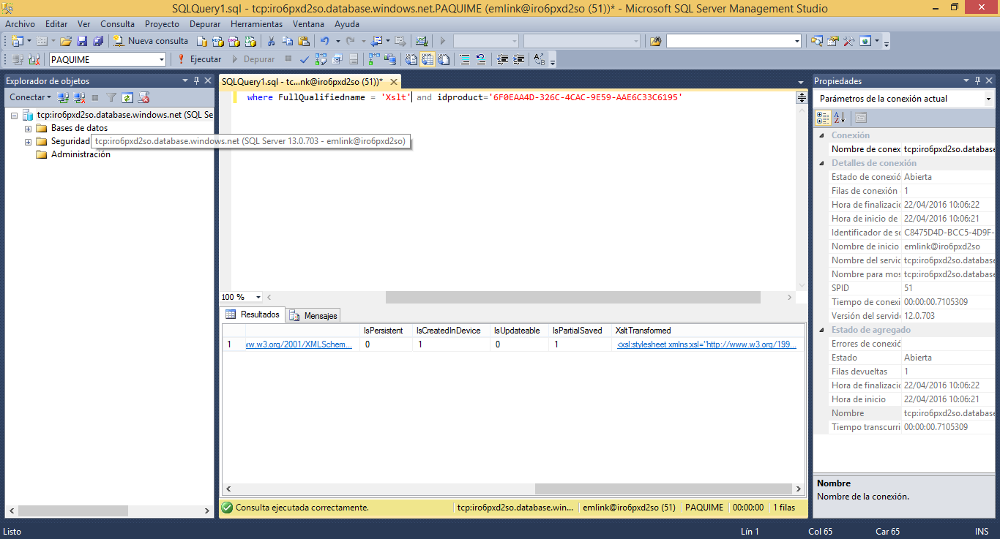
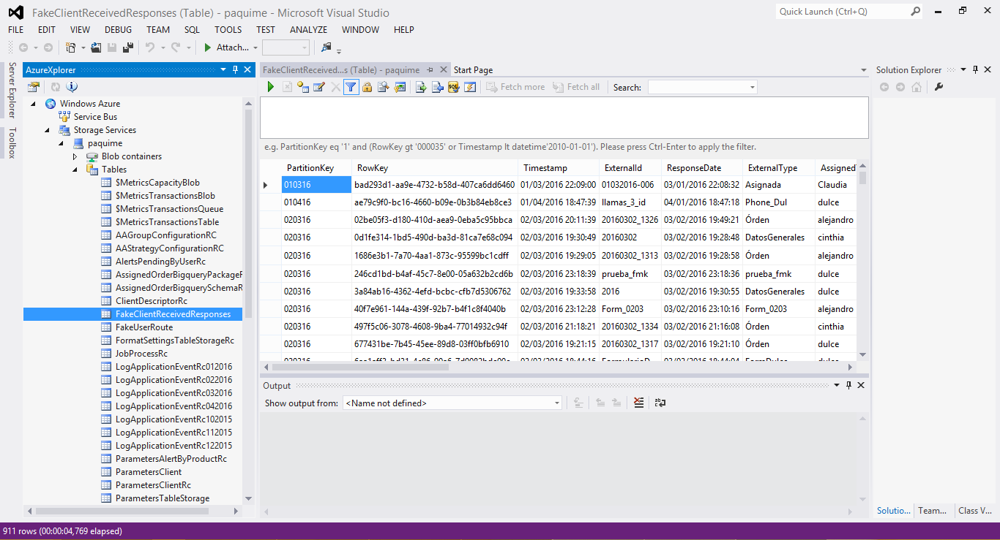

# Respuesta Transformada _ XSLT

El Xslt es un lenguaje de transformación estilos para documentos xml y dar un formato de salida como puede ser otro xml o un html.

Las respuestas de una orden que se entregan a cliente pueden o no transformarse con un archivo Xslt, según convenga el formato de salida y la información al cliente.

Para que una respuesta sea entregada con un formato de salida diferente al que se entrega el archivo Xslt debe encontrarse en la tabla WorkOrderFormType en la columna XsltTransformed.



La respuesta transformada sólo se puede ver en el servicio del cliente.



Ejemplo de una respuesta desde Android.

```
<?xml version="1.0" encoding="utf-8"?><response productid="6f0eaa4d-326c-4cac-9e59-aae6c33c6195" externalid="mauin1_20160322_133831" externaltype="Xslt" assignedto="mauin1" initialdate="20160322 13:38:32" finaldate="20160322 13:38:58" responsedate="20160322 19:39:04" initiallatitude="0" finallatitude="0" initiallongitude="0" finallongitude="0" formiikresponsesource="Mobile"><xslt>
<datos>
<nom>Mauricio</nom>
<apaterno>Mondragon</apaterno>
<amaterno>Mtz</amaterno>
<genero>Masculino</genero>
<fechanac>22/03/1991</fechanac>
<dir>Manzanas </dir>
</datos>
<formiikresponsesource>Mobile</formiikresponsesource>
</xslt></response>
```

Ejemplo de archivo Xslt.

```
<xsl:stylesheet xmlns:xsl="http://www.w3.org/1999/XSL/Transform" version="1.0"> <xsl:output method="xml" indent="yes"></xsl:output>
 <xsl:template match="Response/Xslt">
   <datos_personales>
     <nombre_cliente>
       <xsl:value-of select="datos/nom"></xsl:value-of>
     </nombre_cliente>
     <apellidos>
       <xsl:value-of select="datos/apaterno"></xsl:value-of>
       <xsl:value-of select="datos/amaterno"></xsl:value-of>
     </apellidos>
     <genre>
       <xsl:value-of select="datos/genero"></xsl:value-of>
     </genre>
     <fecha_nacimiento_cliente>
       <xsl:value-of select="datos/fechanac"></xsl:value-of>
     </fecha_nacimiento_cliente>
   </datos_personales>
 </xsl:template></xsl:stylesheet>
```

Ejemplo de respuesta entregada al cliente.

```
<?xml version="1.0" encoding="utf-16"?><datos_personales><nombre_cliente>Mauricio</nombre_cliente>
<apellidos>MondragonMtz</apellidos>
<genre>Masculino</genre>
<fecha_nacimiento_cliente>22/03/1991</fecha_nacimiento_cliente></datos_personales>
```